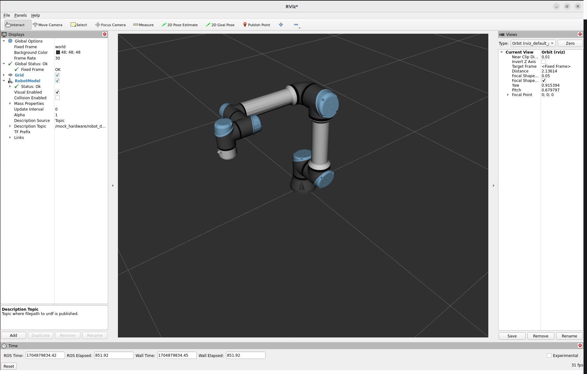

# An application with hardware

## Launcher configuration requirements

This example uses an additional Universal Robots collection package, which includes drivers for communicating with
UR robots and the example URDF content used to visualize the robot arm.

Use AICA Core v4.2.0 together with the `collections/ur-collection` package at version v4.1.0 to reproduce this example.

## URDF Hardware Manager

After starting AICA Studio, open the Hardware Manager 
([localhost:8080/studio/hardware](http://localhost:8080/studio/hardware)). This page shows a table of available URDF
files in the container database with a name and a description.

AICA hardware collections include example URDFs, which are shown on the table with a pad-lock icon indicating that they
are not editable. Users can make an editable copy of a selected URDF with the "Save As" button, or upload and edit
custom URDFs.

From the hardware manager table, select the entry named "Universal Robots 5e (mock interface)". The URDF content should
appear on the right side of the page.

```xml title="Universal Robots 5e (mock interface)"
<?xml version="1.0" ?>
<robot name="ur5e">
    <ros2_control name="ur5e_mock" type="system">
        <hardware>
            #highlight-next-line
            <plugin>aica_core_interfaces/MockInterface</plugin>
        </hardware>
        ...
    </ros2_control>
</robot>
```

The selected URDF specifies the hardware plugin `aica_core_interfaces/MockInterface`. This is a generic AICA plugin that
mocks real robot hardware by perfectly following all commands and reflecting back the robot state.

The mock URDF will be used to demonstrate the hardware interface block in AICA applications.

:::info

Refer to the overview section [Controlling robots with ros2_control](../../../docs/concepts/ros-concepts/controlling-robots.md) for
more context.

:::

## Setting up the application

Go to the Editor page using the top navigation bar or at
[localhost:8080/studio/editor](http://localhost:8080/studio/editor) and create a new application.

Enter the following YAML and generate the graph.

```yaml
schema: 2-0-2
dependencies:
  core: v4.2.0
on_start:
  load:
    hardware: mock_hardware
hardware:
  mock_hardware:
    display_name: Hardware Interface
    urdf: Universal Robots 5e (mock interface)
    rate: 60
    events:
      transitions:
        on_load:
          load:
            controller: robot_state_broadcaster
            hardware: mock_hardware
    controllers:
      robot_state_broadcaster:
        plugin: aica_core_controllers/RobotStateBroadcaster
graph:
  positions:
    buttons:
      button:
        x: -120
        y: 260
    hardware:
      mock_hardware:
        x: 500
        y: -20
  buttons:
    button:
      display_name: Activate Controller
      on_click:
        switch_controllers:
          hardware: mock_hardware
          activate: robot_state_broadcaster
```

The application graph should show a hardware interface with a controller and an event trigger.


## The example explained

The application begins with the `on_start` directive to list the initial application events. In this case, the only
event that occurs on start is to load the `mock_hardware` hardware interface.

```yaml
on_start:
  load:
    hardware: mock_hardware
```

Moving down the application, the top-level `hardware` field defines the hardware interfaces in an application. In this
case, there is one hardware interface called `mock_hardware`.

```yaml
hardware:
  mock_hardware:
    display_name: Hardware Interface
    urdf: Universal Robots 5e (mock interface)
    rate: 60
    events:
      transitions:
        on_load:
          load:
            controller: robot_state_broadcaster
            hardware: mock_hardware
    controllers:
      robot_state_broadcaster:
        plugin: aica_core_controllers/RobotStateBroadcaster
```

The `urdf` field specifies the `Universal Robots 5e (mock interface)` URDF as identified on the hardware manager page.

The `events` field lists events that occur on state transitions of the hardware interface. In this case, the `on_load`
transition is used to load a controller once the ardware interface is loaded.

The `controllers` field lists the controllers associated with the hardware interface. In this example, the only
controller is the `aica_core_controllers/RobotStateBroadcaster`, which is a generic AICA controller that broadcasts the
robot joint states and transforms.

:::tip

Learn more about available properties for application hardware on
the [YAML application syntax](../../../docs/reference/yaml-syntax.md) reference page.

:::

At the bottom, the application defines positions of components in the graph and event trigger buttons under the
top-level `graph` field.

```yaml
graph:
  positions:
    buttons:
      button:
        x: -120
        y: 260
    hardware:
      mock_hardware:
        x: 500
        y: -20
  buttons:
    button:
      display_name: Activate Controller
      on_click:
        switch_controllers:
          hardware: mock_hardware
          activate: robot_state_broadcaster
```

The `on_click` field of buttons defines the application events that are triggered with the event button is pressed. In
this case, it triggers the `switch_controllers` event which is used to activate the `robot_state_broadcaster` controller
on the `mock_hardware` interface.

## Run the application

Putting it all together, pressing Play on this application should load the mock hardware interface and load the
broadcaster controller. When the trigger button is pressed in the graph editor, the broadcaster will be activated.

:::tip

Controllers can also be "auto-activated", similar to the procedure in the
[previous example](./editor-example.md#auto-lifecycle-events). Try to modify this example by removing the trigger
button and navigating to the controller settings to toggle the "auto-activate" behavior. Once the application is started
again, the controller should now automatically be active.

:::

## Visualize the mock robot in RViz

:::info

Only users with a Linux host can visualize the robot with RViz. On macOS, AICA Launcher will not show the RViz option.

:::

Open RViz using the gear menu icon in the bottom right of AICA Launcher and choosing the "Launch RViz" option.

:::note

A native 3D viewer will be available in AICA Studio for all platforms in an upcoming version.

:::

When the application is playing and the robot broadcaster controller has been activated, the robot model should appear
in the RViz viewer.



<!-- TODO
The next example will add another controller to the mock hardware to move the robot based on a component output.
-->
