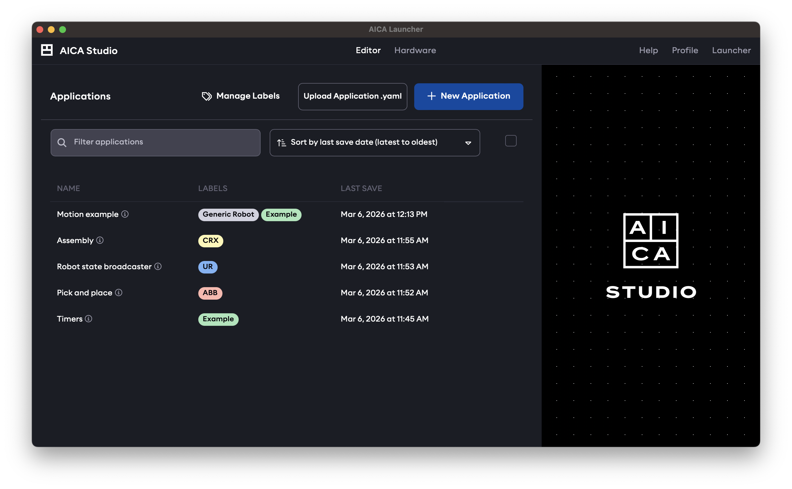
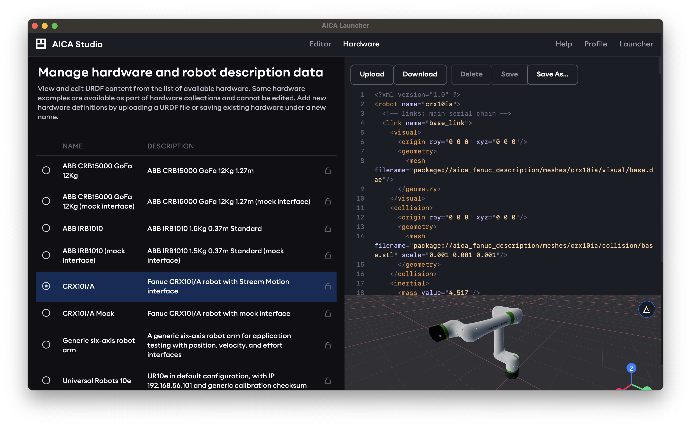
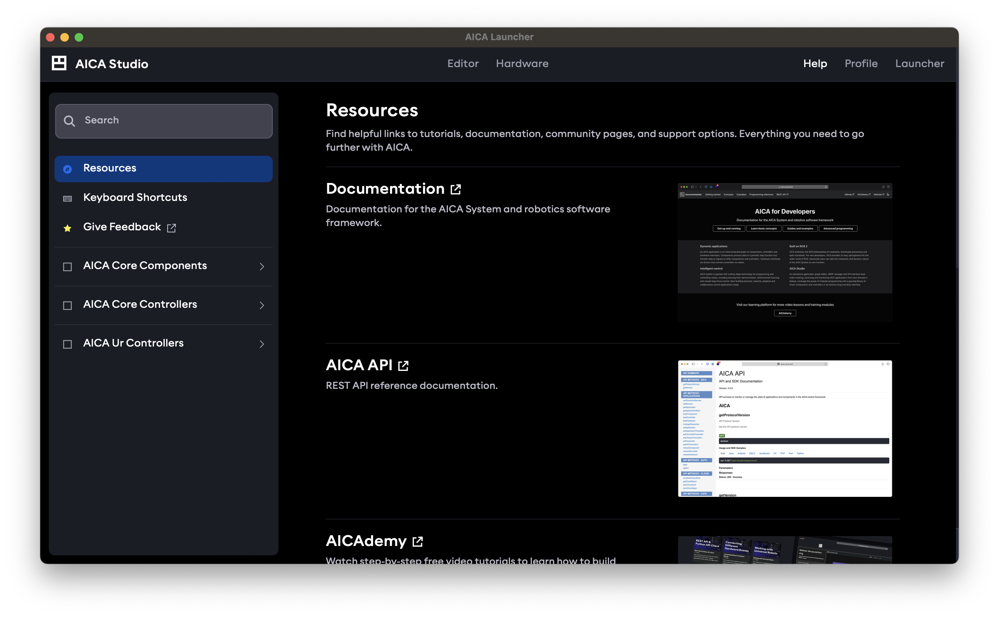
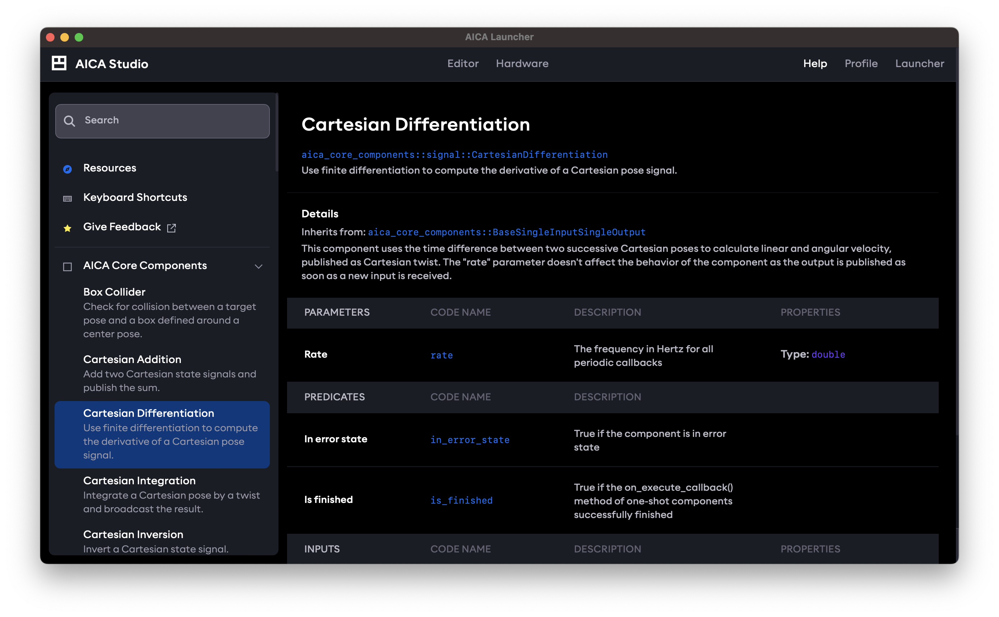
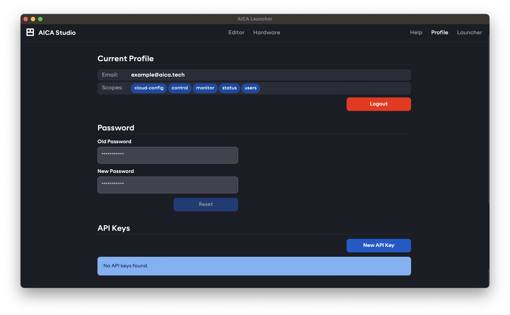
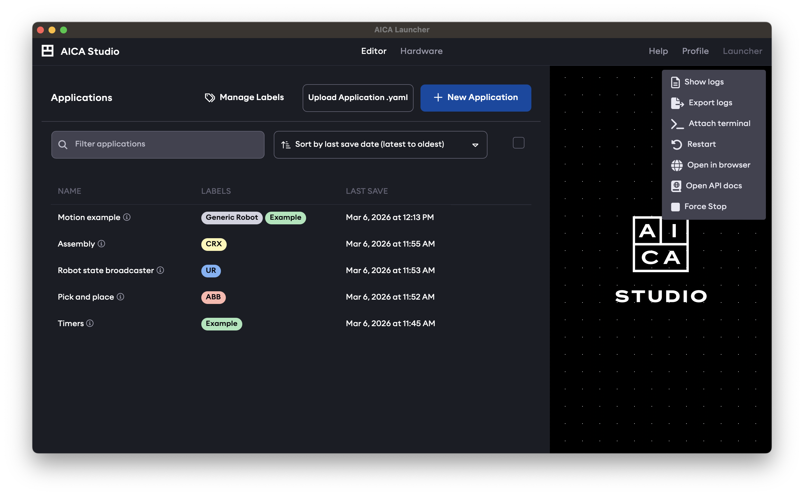

import DocCardList from '@theme/DocCardList';

# AICA Studio

This section will give a brief, high-level tour of AICA Studio to help situate new users. Underlying concepts and
examples are covered in more depth in later sections of this documentation.

In short, AICA Studio is the graphical user interface layer to the AICA System to create, monitor and extend advanced
robotic applications. It features an interactive application editor with a dataflow graph builder, a 3D scene visualizer
and live data visualization. It also allows managing hardware configuration, user profiles and more.

## Logging in to AICA Studio

When accessing AICA Studio through Launcher or the browser, you may be prompted to log in or create a new profile.
This is explained in more detail in the [Profiles and scopes](./studio/profiles-and-scopes) section.

## Application manager and editor

After logging in, AICA Studio starts with the Editor page open by default, which is a combined application manager and
editor. This page can also be accessed by clicking the **Editor** link in the top navbar.

In the application manager view, it shows a list of saved applications and presents options to create a new application
or upload applications from file. For a new installation with no saved applications, the list will be empty.

Selecting an application from the list or creating a new application will enter into the application editor, the
elements of which are described in the following subsections. To return to the application manager view, the currently
open application must first be closed.

<DocCardList />

## Hardware manager

The other top-level page is the hardware manager, available under the **Hardware** link in the top navbar.

This page lists available hardware descriptions in the URDF format. Some built-in examples will be included in the
installation depending on which specific hardware collection packages were installed in the AICA System configuration.
New hardware definitions can be added by uploading a URDF file or copying and editing existing hardware under a new
name.

Any hardware listed in the hardware manager can be loaded and used in an application.

## Help

The **Help** link in the top right section of the navbar is used to access a help page with links to documentation and
learning resources.

It also includes reference documentation for the installed components and controllers in the AICA System configuration.

## Profile

The **Profile** link in the top right of the page is used to access and manage the currently logged-in user profile.

Read more about user scopes and API keys in [Profiles and scopes](./studio/profiles-and-scopes.md).

## AICA Studio with Launcher

When using AICA Launcher v1.5.0 or newer with AICA Core v5.1.0 or newer, settings and controls related to AICA Launcher
are available from the top right **Launcher** link in the navbar. This can be used to open Studio in a separate browser
window, view API reference, logs or other container details, or to stop and return to the AICA Launcher configuration
selection.

