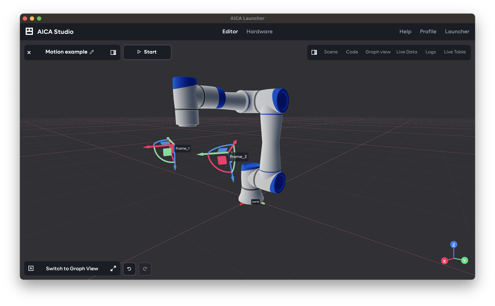
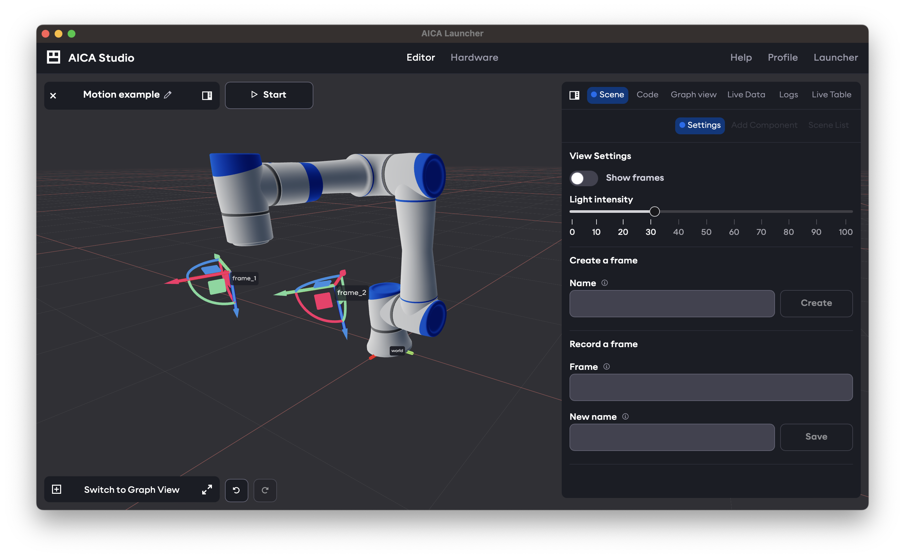
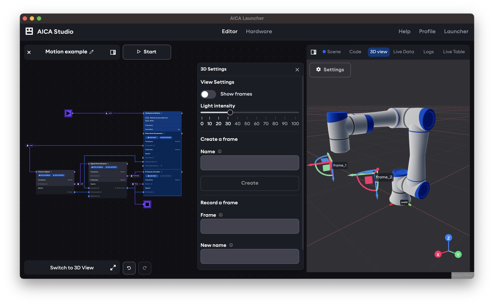

The 3D scene view shows hardware models and frames of the current application. When the application is running, the
hardware positions and frames update live according to the active control logic.

The 3D view can be rotated by clicking and dragging within the scene, while holding right-click and dragging pans the
view. Scroll over the view to zoom in or out. If the application defines any frames, they can be positioned and rotated
by clicking and dragging on the frame markers.

When the main view shows the 3D view, settings and controls for the 3D view can be accessed through the right panel
Scene tab and Settings subtab. View settings control what is displayed in the 3D view, while additional controls allow
creating or recording new application frames or joint positions from the current configuration.

When the main view shows the application graph, the 3D view can be accessed in the right panel under the 3D view tab.
When this tab is selected, the mini-view is automatically minimized and 3D settings are accessed through an additional
mini-panel from the Settings button.

