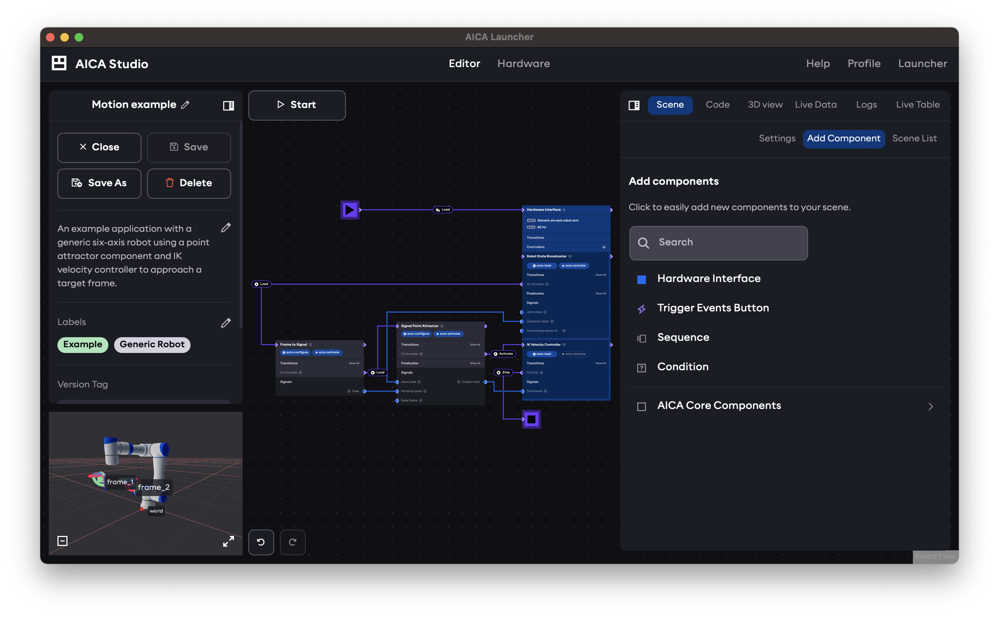

# Application editor

When an application is created or selected for editing, the following application editor screen will appear.

The editor features two panels on the left and right side of a main view, with a mini-view on the bottom left. Next to
the left panel is the main runtime control button. The Start button starts running the loaded application, which then
changes into a Stop button to stop the running application.

## Main view

The main view shows the iconic AICA dataflow graph by default, which is explained more in the next section, while the
mini-view shows a preview of 3D scene view. The left and right panels as well as the mini-view switcher can be minimized
with the respective icon buttons to provide more screen space for the main view.

The main view can also be switched to render the 3D scene of the application by clicking on the mini-view on the bottom
left of the page. The mini-view will then correspondingly show the application graph instead of the 3D scene, and can
be clicked again to switch the main view back to the application graph.

## Left panel

The left panel is used for managing application metadata with controls to rename, describe, and save the working
version. Exit back to the application manager screen using the **Close** button in the left panel. When the left panel is
minimized, the **X** button on the top left has the same function. Closing an application will prompt to save or discard
unsaved changes. Running applications must be stopped before closing or switching applications to avoid safety issues
for any connected hardware.

## Right panel

The right panel is the context-aware data and property manager for actual application content and behavior grouped
in various tabs. The width of the right panel can be adjusted with drag interactions to remain compact for normal usage
or to take up more space for a split-screen effect with the main view. The right panel tabs contain the main tools for
configuring and monitoring the application.

Read on to learn more about the [application graph editor](./graph), the [3D scene](./3d) and the
[right panel tabs](./right-panel-tabs).