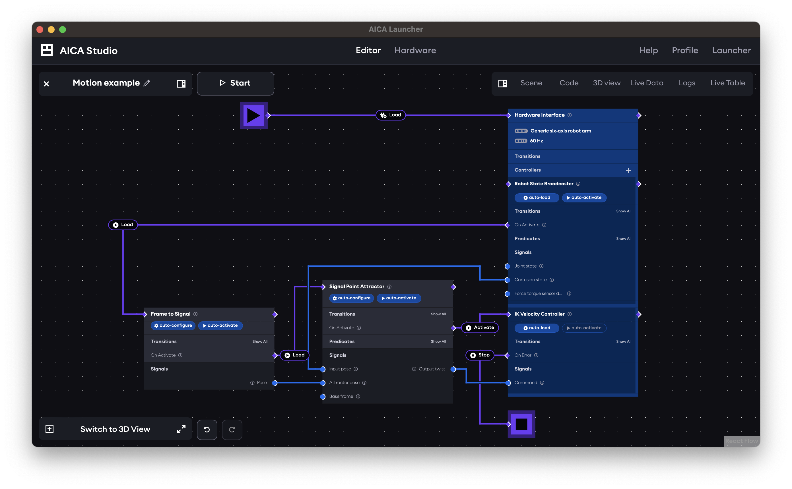
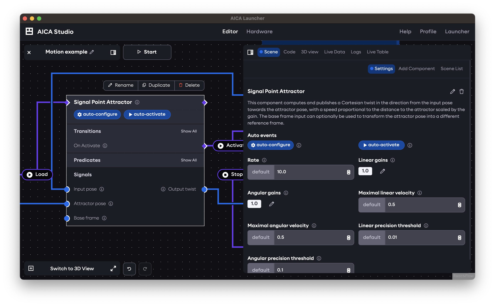
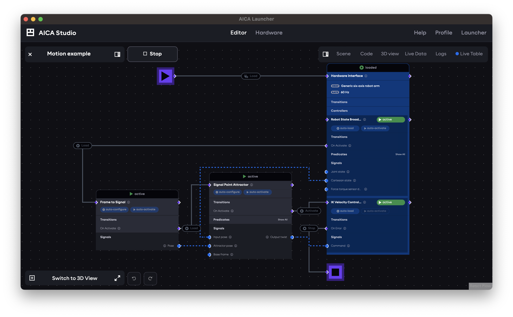

import Tabs from '@theme/Tabs';
import TabItem from '@theme/TabItem';
import EventHandle from './assets/event-handle.svg';
import SignalHandle from './assets/signal-handle.svg';
import AddComponentMenu from './assets/aica-studio-add-component.png';
import EditingGraphEdges from './assets/aica-studio-editing-graph-edges.gif';
import EventEdge from './assets/aica-studio-event-edge.png';

# Application graph

The AICA application graph is a unique way of expressing complex and reactive logic for robotic control. It combines
data-flow programming of continuous signals with event-driven logic and state management.

In this section, the basic elements and interactions of the application graph will be described at a high level.
Mastering the graph is key to unlocking advanced programming capabilities, so be sure to continue reading further
concepts and examples later in this documentation.

## Nodes and edges

In graph terminology, a node is a block in the graph and an edge is a connecting line. The nodes in the AICA application
graph represent **components** (generic computational blocks that process input data and produce output data) and
**hardware interfaces** (drivers to externally connected devices that follow control commands from components),
alongside built-in elements such as sequence or condition blocks or the start/stop nodes.

The edges connecting these nodes represent either **signals** (blue) or **events** (purple). Signals are used for
continuous data exchange (e.g., control loops, signal processing, or other kinds of data flow) while event edges capture
discrete logic (e.g., triggering events or representing conditional true/false states).

:::info

These application building blocks are described in more detail in
the [concepts](/docs/category/application-building-blocks) section.

:::

## Interacting with the graph

Click and drag on the background of the graph to pan the view and zoom in and out by scrolling.

### Adding elements to the graph

Application elements can be added to the graph using the right panel under the Scene tab and Add Component subtab:

  

At the top of the list are the "Hardware Interface", "Trigger Events Button", "Sequence" and "Condition" nodes. These
are followed by a list of all available components from AICA Core and any additionally installed packages, grouped by
package. Clicking on any element in the right panel will automatically add it to the graph.

The search field can be used to filter the available elements by name or description.

### Managing graph elements

Nodes can be moved by clicking and dragging them. When a node is selected, a small menu provides options to rename,
duplicate or delete the node. Additionally, settings for the selected node will appear in the right panel under the
Scene tab and Settings subtab. This is mainly used to configure automatic state transitions such as "auto-configure" or
"auto-activate" and to set parameter values. The means of editing a parameter value depend on the parameter type, with
simple toggles for boolean parameters, input fields for numeric and string parameters, and an input menu accessed
through the pencil edit icon for array parameters.

Depending on the application element, clicking on various parts of the node will provide additional interaction options.
In particular, components and hardware interfaces have toggleable badges to configure automatic state transitions
without needing to open the Settings tab, while sequences have a toggle to enable looping behavior. Sections such as
Transitions, Predicates and Services will have a Show All button that can be used to expand or collapse the respective
interfaces.

### Deleting graph elements

To delete a node from the graph, press the small menu icon in its top right corner, then click Remove.

:::tip

<Tabs groupId="os">
<TabItem value="linux" label="Linux">

Nodes can also be deleted by selecting them with a click and pressing the Backspace key on your keyboard.

</TabItem>
<TabItem value="mac" label="macOS">

Nodes can also be deleted by selecting them with a click and pressing the Delete key on your keyboard.

</TabItem>
</Tabs>

:::

### Managing graph edges

Edge connections can be made between nodes using the respective signal edge
handle <SignalHandle className="inlineEdgeHandleSVG"/> and event edge
handle <EventHandle className="inlineEdgeHandleSVG"/>. The white side of the handle indicates the directionality of the
edge; when the white side is facing away from a node, the handle is an "output" or a "source" for the edge. When the
white side is facing towards the node, the handle is an "input" or a "target". Edges can only be connected between
compatible handles, which generally means inputs can only be connected to outputs, and signal and event edges cannot
be mixed.

Click and drag from one handle to another compatible handle to make a new edge connection. Alternatively, click once on
one handle and click again on another handle to make the edge connection and avoid dragging across the graph.

#### Changing an event type

Event edges show the type of event they trigger as a label on the edge. To change the type of event that should be
triggered, click on the event label on the edge to open a selection menu showing other available event types (for
example, Load, Unload, Configure...) and click on the desired event.

    

#### Customizing edge paths

Edge paths can be manually edited for better graph layouts in any of the following ways:

- Drag an edge segment
- Click once on an edge to create a breakpoint, then drag the edge segment on either side of the breakpoint
- Click on two parts of the edge to create two breakpoints, then drag the intermediate edge segment

    

Note that dragging the first and last edge segments (i.e., those that connect directly to the edge handle) is not
possible without first creating a breakpoint.

:::tip

<Tabs groupId="os">
<TabItem value="linux" label="Linux">

To delete an edge, select it with a click and then press the Backspace key on your keyboard.

</TabItem>
<TabItem value="mac" label="macOS">

To delete an edge, select it with a click and then press the Delete key on your keyboard.

</TabItem>
</Tabs>

:::

## Runtime states

When an application is running, the graph view shows the states of each component in a banner above the node. It also
indicates which signals are actively transporting data with line animations and which event edges are triggered with
highlighting colors.

