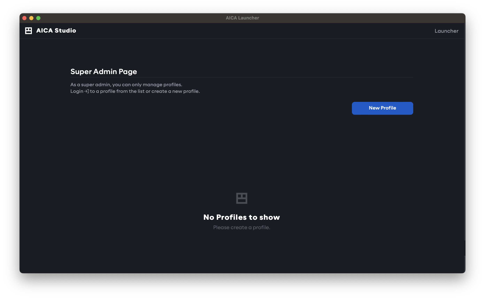
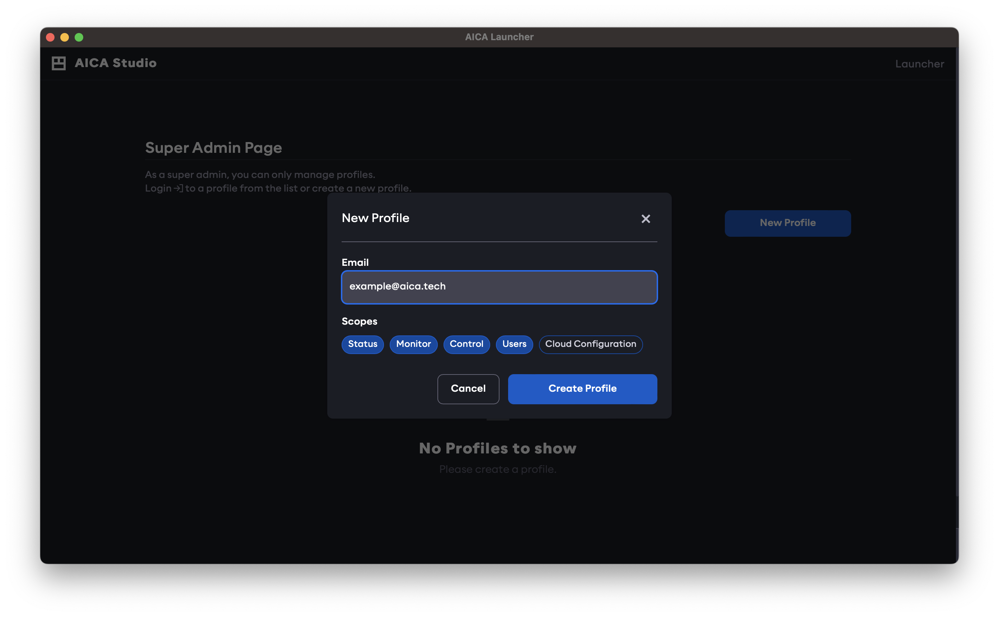
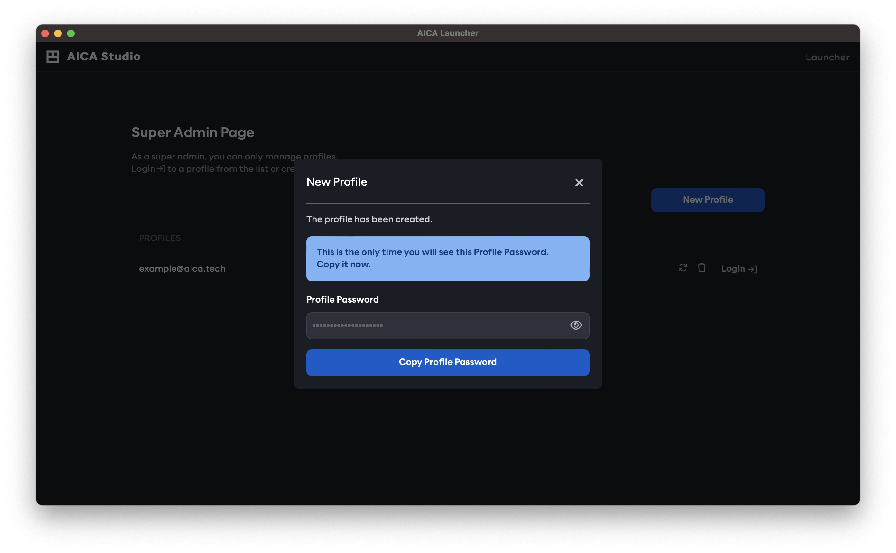
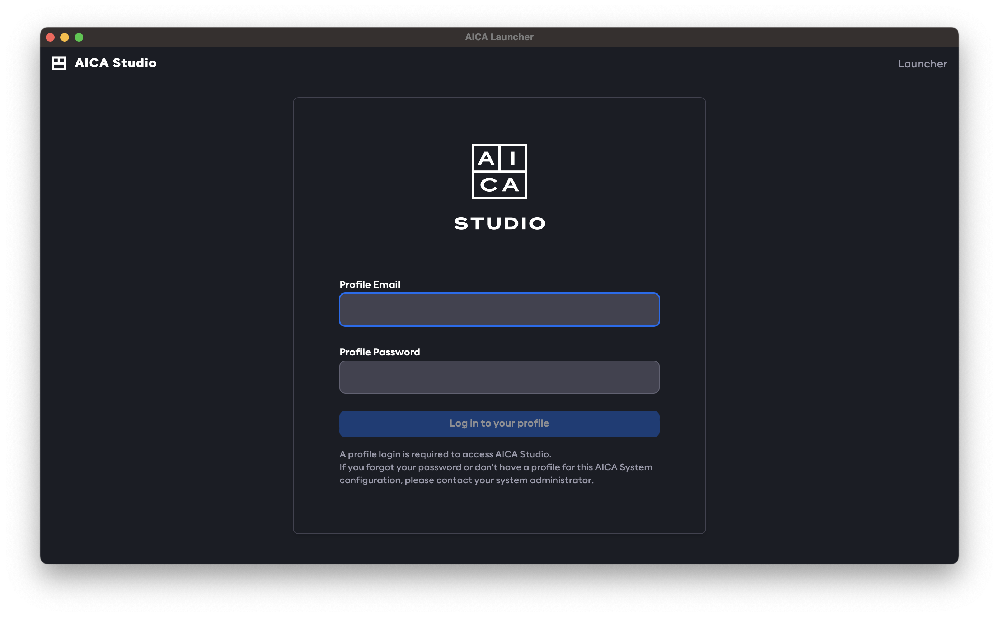

The concept of "Profiles" in this section refers to creating distinct access credentials (or service accounts) for
different operational purposes, such as for a monitoring dashboard with view-only permissions or an operator interface
that can start and stop applications.

:::note

An AICA System License is a **single-user** license intended for one primary developer. The platform does not currently
support live, simultaneous collaboration with other developers on the same system instance.

:::

Authentication prevents unauthorized users or software clients from accessing or controlling a running instance of the
AICA System through AICA Studio or the API, even if they have access to the IP address and port of the AICA Core server.

The user launching an AICA System configuration from AICA Launcher is treated as the system administrator rather than a
regular profile, and must first switch to a regular profile to access AICA Studio.

This section describes how to manage profiles with specific access scopes to explicitly authorize access to the running
AICA System through a web browser or API client.

:::info

System administration privileges and API authentication are supported by AICA Launcher as of v1.2.0 and the Python API
Client as of v3.1.0. Upgrade to the latest versions of these tools for full compatibility.

:::

## Scopes

AICA Studio may have different or limited functionality depending on the scopes granted to the logged-in profile.
Similarly, an API key with appropriate scopes is required to access respective endpoints and functionalities of the API.
The available levels of scopes are described below.

### `status`

Read-only access to high-level information about the AICA System such as the available installed features. This is the
minimum required scope.

### `monitor`

Read-only access to specific information about the AICA System such as configuration database entries or the state and
live telemetry of running applications. Requires the `status` scope.

### `control`

Write-level access to edit applications, hardware entries and other configurations, and control-level access to set,
start and manage running applications. Requires the `monitor` scope.

### `users`

Administration access to manage profiles (re-assigning scopes, resetting passwords, or deleting profiles) 

### `cloud-configuration`

Administration access to authorize and manage cloud service integrations.

## Profiles

When using AICA Launcher as the system administrator, AICA Studio will show a "Super Admin" landing page to select or
manage the profile. Brand-new configurations will have no existing profiles.

Profiles are created using an email address as the identifier and can be granted a combination of [scopes](#scopes).
To edit and run applications in AICA Studio, the `control` scope is required.

:::note

The email address used to create a new profile is only used as an identifier and is unrelated to the email address used
for [licensing](./installation/licensing). Profiles are defined locally to a specific AICA System Configuration, and
access scopes or passwords are not inferred or shared between different configurations, even if the same email address
is used.

:::

To create a new profile, click on the **New Profile** button in the Settings page, provide an email address and the
desired scopes.

A random password is generated for the newly created profile. It is only shown once, so it should be copied and stored for
later use. If the password needs to be changed, first log out from the User page (or open AICA Studio in a new browser
session), and log in as the new user with the generated password. Then, change the password in the User page by entering
the generated (old) and the desired (new) password.

:::tip

If AICA Studio is accessed from a web browser, or if the user logs out of the current AICA Studio session, a valid
profile email and password must be supplied to log in to AICA Studio.

:::

The [Profile](../studio.md#profile) page in AICA Studio can be used to view the current user with their available scopes, change the password or
create API keys.

## API Keys

Other than accessing AICA Studio through a browser, users or software clients can interact with the AICA System using
the API. In this case, an API key is required for authentication. This can be generated in the Profile page in
AICA Studio, by clicking on the **New API Key** button. Provide a name and the desired scopes; note that these
cannot surpass the scope of the logged-in user.

Just as with the creation of new profiles, the newly created API key is shown once to be copied and saved in a secure
place, as it cannot be accessed later. It can then be used it to authenticate and access AICA Core through the API.

If an API key is lost or compromised, delete it from the Users page and generate a new one.

:::tip

Refer to our [API client documentation](https://pypi.org/project/aica-api/) for more info on the usage of API keys.

:::