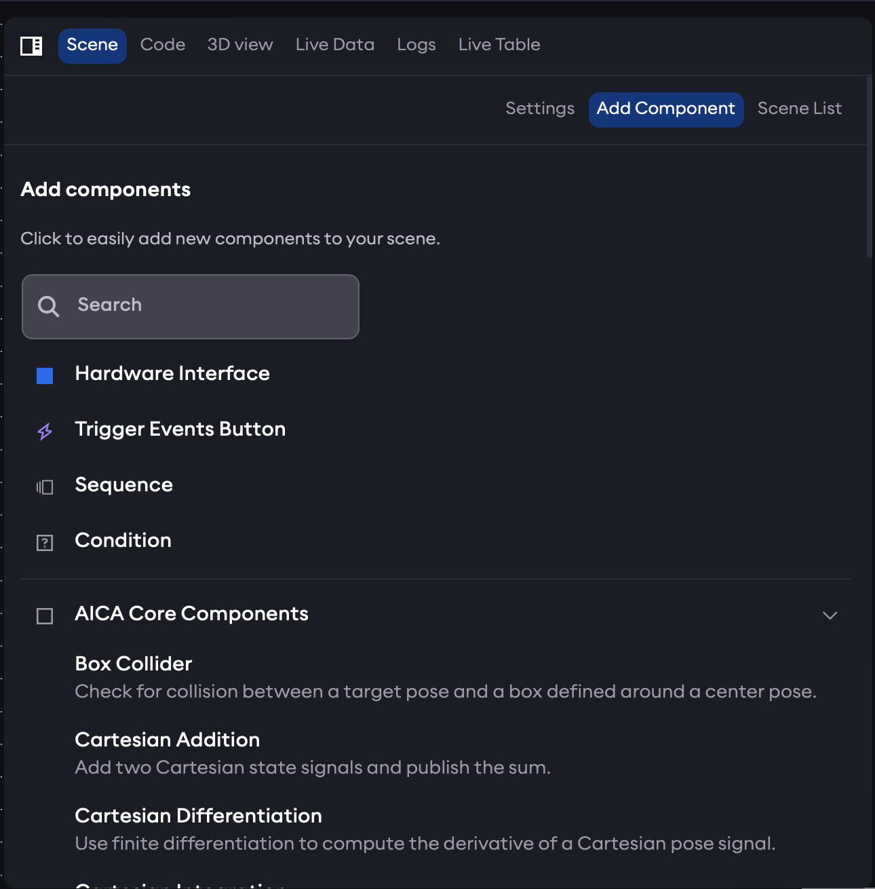
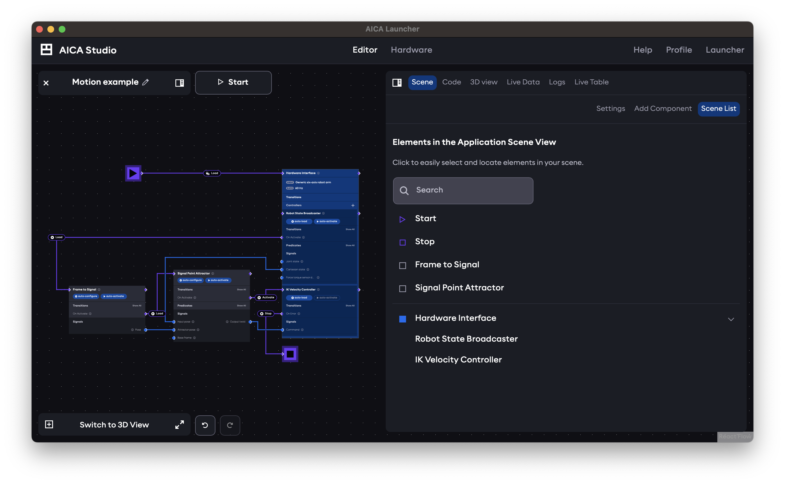
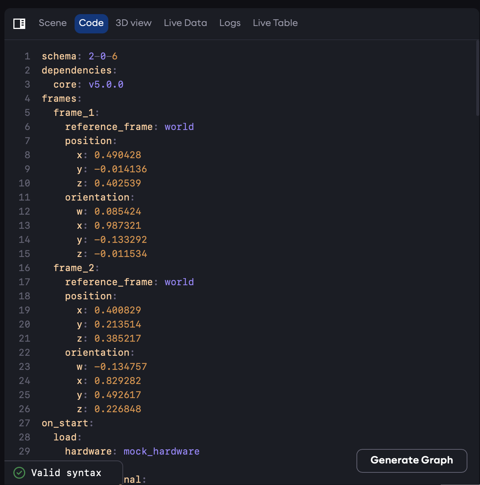
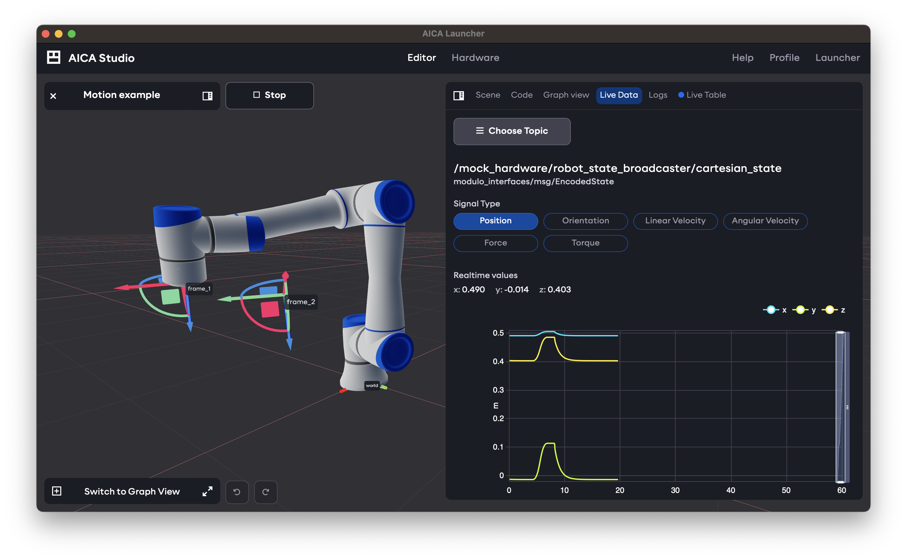
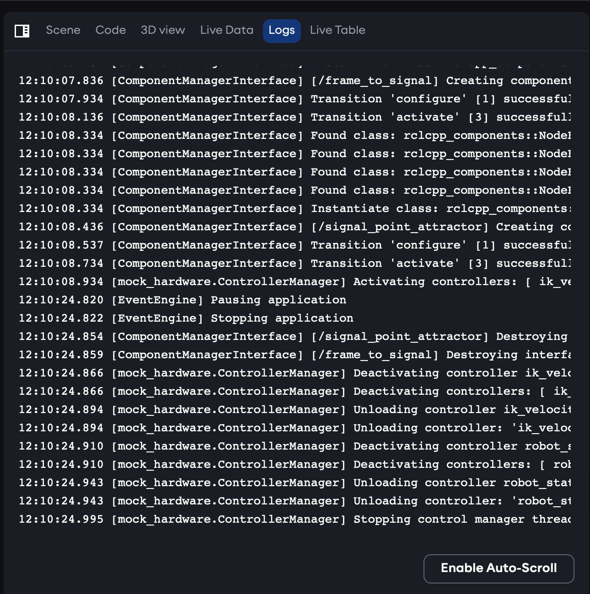
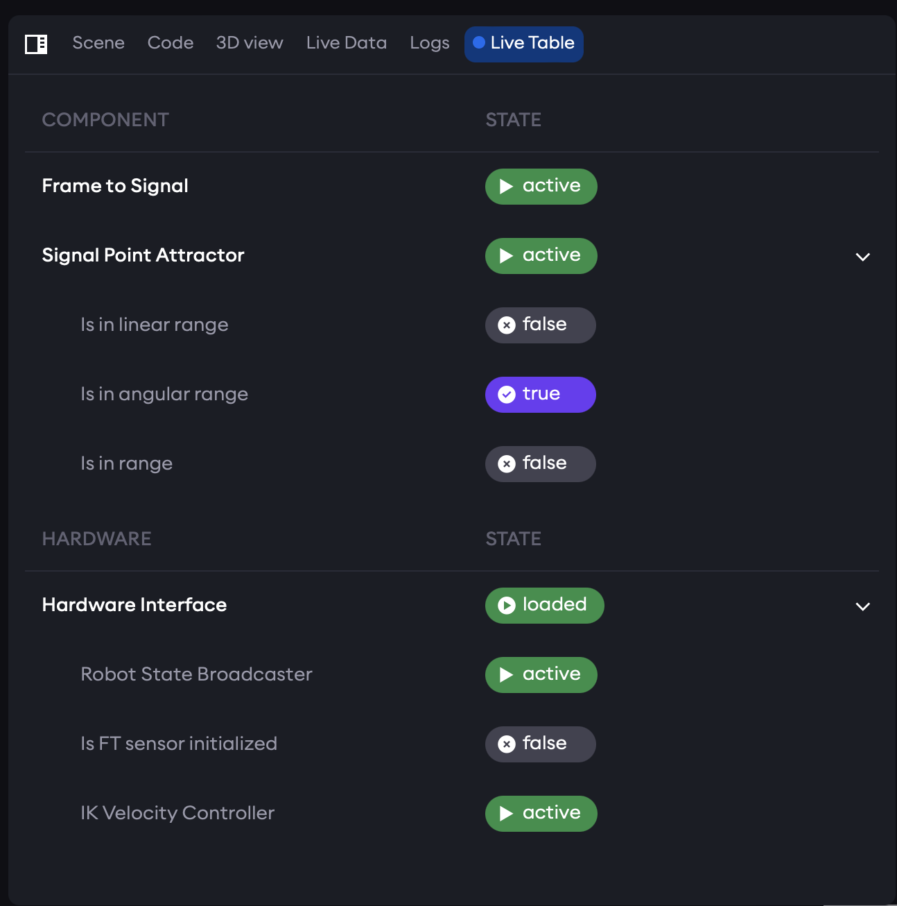

The right panel of the AICA application editor is divided into the following tabs:

## Scene

The scene tab contains three sub-tabs for settings, adding components, or listing elements in the scene.

### Settings

The settings sub-tab is context-aware depending on the selected element in the application graph. It shows relevant
properties and information and provide controls to change parameters and behavior of the element.

### Add Component

The Add Component sub-tab is used to add elements to the application.

### Scene List

The Scene List is a compact display of all elements in the application. Clicking on an element will select it in the
application graph, zoom the view to center it, and show its settings in the Settings sub-tab.

## Code

The Code view shows the YAML code representation of the AICA application. This code is automatically regenerated
whenever any edits are made to the application graph or to elements in the 3D scene. It is possible to change the YAML
directly using the built-in editor. However, changes will not take affect until the "Generate Graph" button is pressed.
In case of syntax errors, graph generation will fail and the relevant error messages will be displayed in the Code view.

## 3D view / Graph view

Depending on whether the main view shows the [application graph](./graph.md) or the [3D view](./3d.md), this tab will
provide the alternate view. The right panel mode of the graph view is non-interactive for modifying nodes, edges or
parameters but allows zooming, panning and pressing trigger buttons for configured events. When the 3D view is in the
right panel, the 3D view settings are accessed from a mini-panel rather than the Settings sub-tab of the Scene tab.

## Live Data

View the data running on signals and other background topics on the ROS 2 network. Use the Choose Topic selector to
change the topic to visualize. Selecting a signal edge in the graph view while the application is running will
automatically select the appropriate signal topic for visualization in this tab.

For certain signal types, in particular related to Cartesian or joint states, individual state variables can be selected
for visualization.

## Logs

The logs view shows log entries from the running system color-coded by severity level. The auto-scroll option
automatically scrolls the view to the bottom whenever new log entries are added. Scrolling up in the log view allows
accessing previous log entries and temporarily disables auto-scroll.

## Live Table

The live state table gives a compact overview of which components and controllers are loaded, what state they are in,
and which predicates and conditions are true or false.

