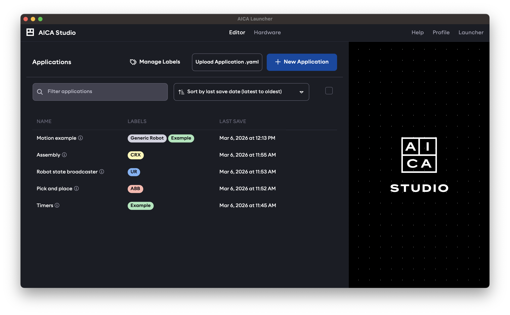
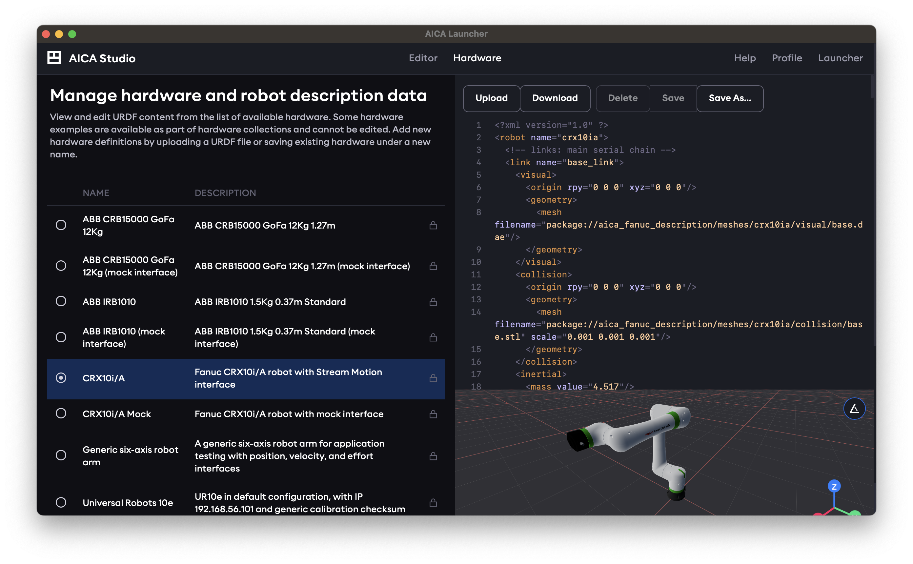
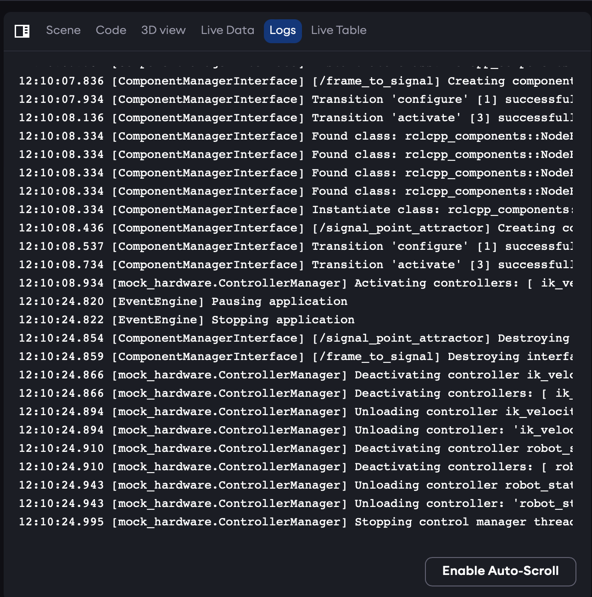

import DocCardList from '@theme/DocCardList';

# AICA Studio

This section will give a brief, high-level tour of AICA Studio to help situate new users. Underlying concepts and
examples will be covered in more depth in later sections of this documentation.

## Application manager and editor

The default landing page when opening AICA Studio is the application manager and editor. It can also be accessed by
clicking the "Editor" tab in the top navbar.

It shows a list of saved applications and presents options to create a new application or upload applications from file.
For a new installation with no saved applications, the list will be empty.

Selecting an application from the list or creating a new application will enter into the application editor, the
elements of which are described in the following subsections.

<DocCardList />

## Hardware manager

The next top-level page is the hardware manager, available under the "Hardware" tab in the top navbar.

This page lists available hardware descriptions in the URDF format. Some built-in examples will be included in the
installation depending on which specific hardware collection packages were installed in the AICA System configuration.
New hardware definitions can be added by uploading a URDF file or copying and editing existing hardware under a new
name.

Any hardware listed in the hardware manager can be loaded and used in an application.

## Docs

Under the "Docs" tab in the top navbar, reference documentation for installed components and controllers in the AICA
System configuration can be accessed.

## Users

The user icon in the top right of the page is used to access and manage the currently logged-in user profile.

Read more about user scopes and API keys in [Users and authentication](/docs/getting-started/users-and-authentication).

## Settings

The settings page is accessed through the cogwheel icon on the top right of the page. It is only available to users with
the `admin` scope and can be used to administer other users as well as connect to cloud storage and services.

## Logs

Finally, the last button on the top right accesses the logs viewer. This page shows log entries from the running system
and can be filtered and searched to find relevant entries.

