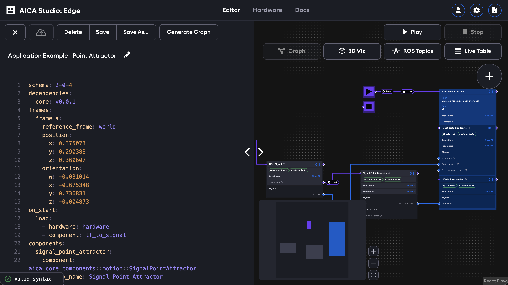

# Application editor

When an application is created or selected for editing, the following application editor screen will appear.

The editor features two panels on the left and right side of the main view. The main view shows the iconic AICA dataflow
graph by default, which is explained more in a following section. However, the main view can also be switched to render
the 3D scene of the application using the mini-view switcher in the bottom left of the page. The left panel is used for
managing application metadata with controls to rename, describe, and save the working version. The right panel is the
context-aware data and property manager for actual application content and behavior grouped in various tabs.

<!-- TODO (v5.1): the left panel also includes the option to tag and restore versions or associate labels -->

The left and right panels as well as the mini-view switcher can be minimized with the respective icon buttons to provide
more screen space for the main view. Additionally, the width of the right panel can be adjusted with drag interactions
to remain compact for normal usage or to take up more space for a split-screen effect with the main view.

On the top of the screen to the right of the left panel is the main runtime control button. The Start button starts
running the loaded application, which then changes into a Stop button to stop the running application.

Exit back to the application manager screen using the "Close" button in the left panel. When the left panel is
minimized, the "X" button on the top left has the same function. Closing an application will prompt to save or discard
unsaved changes. Running applications must be stopped before closing the application.

Read on to learn more about the [application graph editor](./graph.md), the [3D scene](./3d.md) and the
[right panel tabs](./tab-views.md).