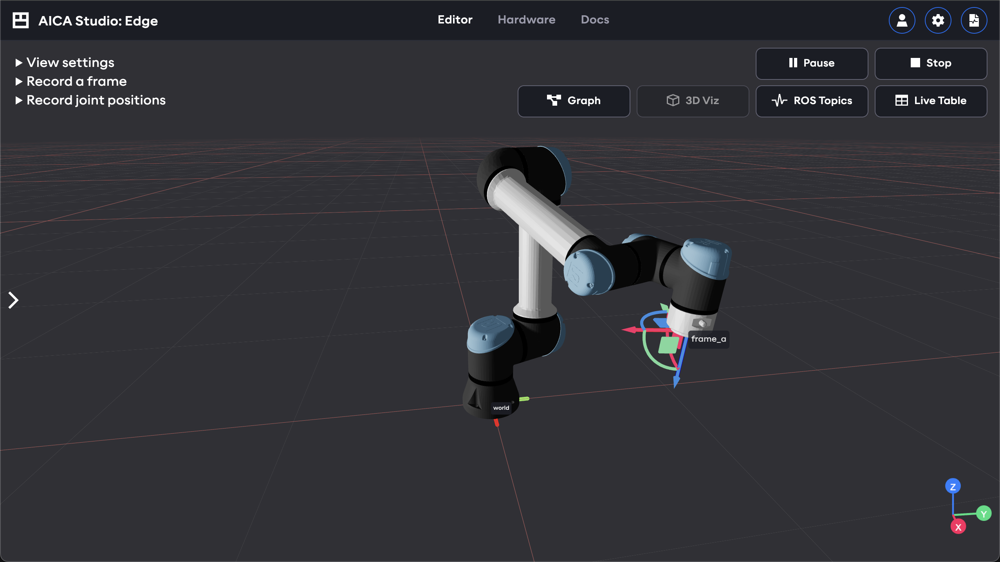
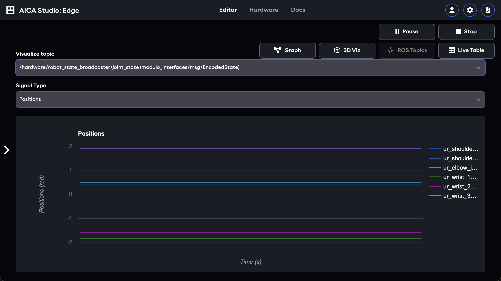
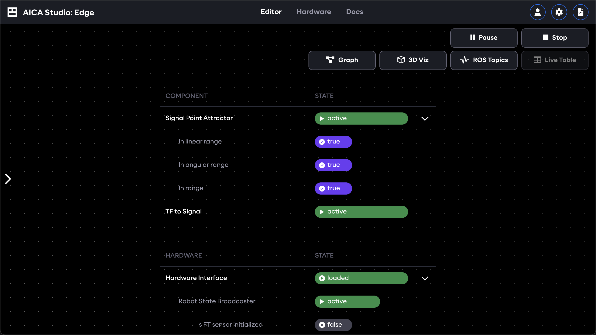

# Live views

Monitor and visualize the state of a running application with the following live views.

## 3D scene

The 3D scene view shows hardware models and frames of the current application. When the application is running, the
hardware positions and frames update live according to the active control logic.

## ROS topics

View the data running on signals and other background topics on the ROS 2 network.

## State table

The state table gives a compact overview of which components and controllers are loaded, what state they are in, and
which predicates and conditions are true or false.

