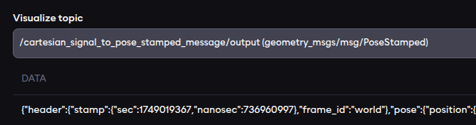
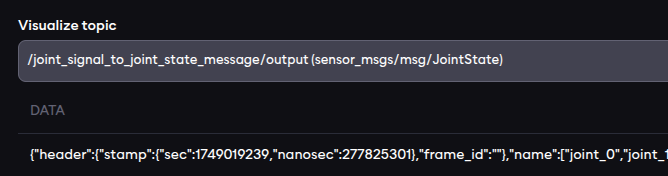

import signalToRos from './assets/signal-ros-example.png'
import rosToSignal from './assets/ros-signal-example.png'

# Signal interoperability

The examples below show how signal translator components included in the core components can be used with a selection of
common ROS message types for interoperability.

:::tip

Review the [Signals concept page](../../concepts/05-building-blocks/01-signals.md) for signals before starting this example.

:::

## AICA signals to standard ROS messages

The first example uses the `Joint Signal To Joint State Message` component to translate the joint state output from the
hardware interface to a `sensor_msgs::msg::JointState` message and the `Cartesian Signal to Pose Stamped` component to
translate the Cartesian state output to a `geometry_msgs::msg::PoseStamped` message.

:::note

Instead of the `Cartesian Signal to Pose Stamped`, one could also use the `Cartesian Signal to Twist Stamped` or
`Cartesian Signal to Wrench Stamped` to translate to a `geometry_msgs::msg::TwistStamped` or
`geometry_msgs::msg::WrenchStamped`, respectively.

:::

<div class="text--center">
  
</div>

With the application loaded and playing, the two components will publish the converted message on their output signal
each time a new message is received from the hardware interface. A jsonified version of those messages can be observed
in the live topic view.





<details>
  <summary>Application YAML</summary>

    ```yaml
    schema: 2-0-4
    dependencies:
    core: v4.3.2
    on_start:
    load:
        hardware: hardware
    components:
    joint_signal_to_joint_state_message:
        component: aica_core_components::ros::JointSignalToJointStateMsg
        display_name: Joint Signal To Joint State Message
        inputs:
        input: /hardware/robot_state_broadcaster/joint_state
    cartesian_signal_to_pose_stamped_message:
        component: aica_core_components::ros::CartesianSignalToPoseStampedMsg
        display_name: Cartesian Signal To Pose Stamped Message
        inputs:
        input: /hardware/robot_state_broadcaster/cartesian_state
    hardware:
    hardware:
        display_name: Hardware Interface
        urdf: Generic six-axis robot arm
        rate: 100
        events:
        transitions:
            on_load:
            load:
                controller: robot_state_broadcaster
                hardware: hardware
        controllers:
        robot_state_broadcaster:
            plugin: aica_core_controllers/RobotStateBroadcaster
            outputs:
            joint_state: /hardware/robot_state_broadcaster/joint_state
            cartesian_state: /hardware/robot_state_broadcaster/cartesian_state
            events:
            transitions:
                on_load:
                switch_controllers:
                    hardware: hardware
                    activate: robot_state_broadcaster
                on_activate:
                load:
                    - component: cartesian_signal_to_pose_stamped_message
                    - component: joint_signal_to_joint_state_message
    graph:
    positions:
        components:
        joint_signal_to_joint_state_message:
            x: 200
            y: 880
        cartesian_signal_to_pose_stamped_message:
            x: 200
            y: 660
        hardware:
        hardware:
            x: 200
            y: -20
    edges:
        hardware_hardware_robot_state_broadcaster_on_activate_cartesian_signal_to_pose_stamped_message_cartesian_signal_to_pose_stamped_message:
        path:
            - x: 80
            y: 400
            - x: 80
            y: 720
        hardware_hardware_robot_state_broadcaster_on_activate_joint_signal_to_joint_state_message_joint_signal_to_joint_state_message:
        path:
            - x: -20
            y: 400
            - x: -20
            y: 940
        hardware_hardware_robot_state_broadcaster_joint_state_joint_signal_to_joint_state_message_input:
        path:
            - x: 120
            y: 520
            - x: 120
            y: 1060
        hardware_hardware_robot_state_broadcaster_cartesian_state_cartesian_signal_to_pose_stamped_message_input:
        path:
            - x: 140
            y: 560
            - x: 140
            y: 840
    ```
</details>

## Standard ROS messages to AICA signals

Conversly to the first example, this application uses the `Wrench Stamped Message To Cartesian Signal` component to
translate a `geometry_msgs::msg::WrenchStamped` from a motion generation component (implementation not provided, could
be any custom component) to a Cartesian signal that is connected to the force controller of the hardware interface.

:::note

Instead of the `Wrench Stamped Message To Cartesian Signal`, one could also use the 
`Twist Stamped Message To Cartesian Signal` with an IK velocity controller or
`Pose Stamped Message To Cartesian Signal` with an IK position controller if the motion generator would output a twist
or a pose, respectively.

If the generated motion is in joint space, the `Joint State Message To Joint Signal` with a
joint space controller would be the adequate choice.

:::

<div class="text--center">
  
</div>

<details>
  <summary>Application YAML</summary>

    ```yaml
    schema: 2-0-4
    dependencies:
    core: v4.3.2
    on_start:
    load:
        hardware: hardware
    components:
    wrench_stamped_message_to_cartesian_signal:
        component: aica_core_components::ros::WrenchStampedMsgToCartesianSignal
        display_name: Wrench Stamped Message To Cartesian Signal
        events:
        transitions:
            on_load:
            switch_controllers:
                hardware: hardware
                activate: force_controller
        inputs:
        input: /custom_motion_generator/command
        outputs:
        output: /wrench_stamped_message_to_cartesian_signal/output
    custom_motion_generator:
        component: template_component_package::PyComponent
        display_name: Custom Motion Generator
        events:
        transitions:
            on_load:
            load:
                component: wrench_stamped_message_to_cartesian_signal
        outputs:
        command: /custom_motion_generator/command
    hardware:
    hardware:
        display_name: Hardware Interface
        urdf: Generic six-axis robot arm
        rate: 100
        events:
        transitions:
            on_load:
            load:
                - controller: robot_state_broadcaster
                hardware: hardware
                - controller: force_controller
                hardware: hardware
        controllers:
        robot_state_broadcaster:
            plugin: aica_core_controllers/RobotStateBroadcaster
            events:
            transitions:
                on_load:
                switch_controllers:
                    hardware: hardware
                    activate: robot_state_broadcaster
                on_activate:
                load:
                    component: custom_motion_generator
        force_controller:
            plugin: aica_core_controllers/effort/ForceController
            parameters:
            force_limit:
                - !!float 20.0
                - !!float 20.0
                - !!float 20.0
                - !!float 2.0
                - !!float 2.0
                - !!float 2.0
            inputs:
            command: /wrench_stamped_message_to_cartesian_signal/output
    graph:
    positions:
        components:
        wrench_stamped_message_to_cartesian_signal:
            x: 100
            y: 780
        custom_motion_generator:
            x: 100
            y: 420
        hardware:
        hardware:
            x: 680
            y: -20
    edges:
        wrench_stamped_message_to_cartesian_signal_output_hardware_hardware_force_controller_command:
        path:
            - x: 660
            y: 1040
            - x: 660
            y: 820
        wrench_stamped_message_to_cartesian_signal_on_load_hardware_hardware_force_controller:
        path:
            - x: 580
            y: 920
            - x: 580
            y: 660
        hardware_hardware_robot_state_broadcaster_on_activate_custom_motion_generator_custom_motion_generator:
        path:
            - x: 40
            y: 400
            - x: 40
            y: 480
        custom_motion_generator_on_load_wrench_stamped_message_to_cartesian_signal_wrench_stamped_message_to_cartesian_signal:
        path:
            - x: 540
            y: 560
            - x: 540
            y: 740
            - x: 40
            y: 740
            - x: 40
            y: 840
        custom_motion_generator_command_wrench_stamped_message_to_cartesian_signal_input:
        path:
            - x: 500
            y: 680
            - x: 500
            y: 760
            - x: 80
            y: 760
            - x: 80
            y: 1040
    ```
</details>