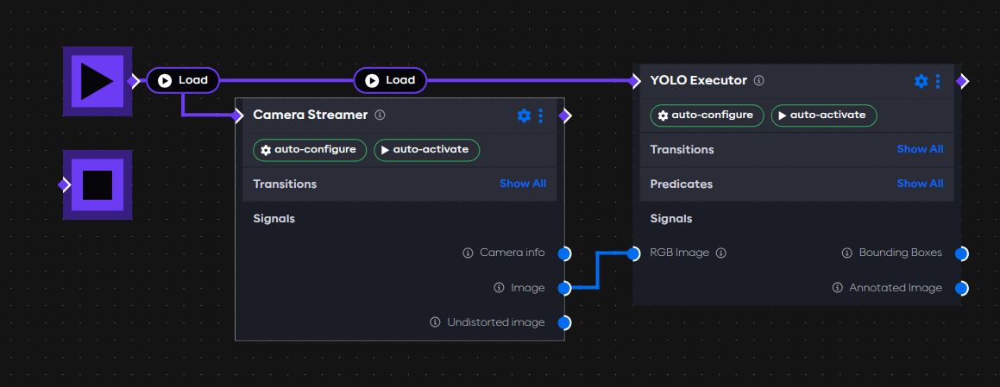
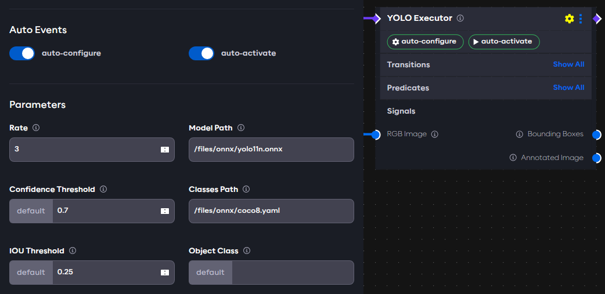
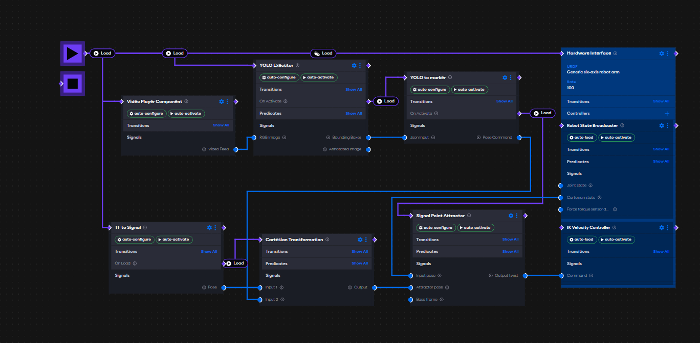

import rvizgif from './assets/object-detection-example-rviz.gif'

# Using YOLO to track objects

<!-- TODO: replace `Object Detection Components` with whatever the package name would be in Launcher -->
This example provides a use case for `Object Detection Components`. We show how to create a custom component which
converts bounding boxes into a 3D pose. The example works with any RBG `sensor_msgs::msg::Image` signal, such as
provided by the Camera Streamer component from `components/core-vision`. The final application will be able to track an
object with a robot based on a fixed camera position.

<div class="text--center">
  
</div>

## Setup

To run a YOLO executor, you need a yolo model file in ONNX format and a YAML class file. Yolo models are widely
available in PT formats. For example, download the lightweight YOLO12n.pt from
ultralytics [here](https://github.com/sunsmarterjie/yolov12).

To convert a PT file to ONNX, run the following Python code with ultralytics installed:

```python
from ultralytics import YOLO
model = YOLO("yolov12n.pt")
model.export(format="onnx")  # creates 'yolov12n.onnx'
```

For this example, also download the standard coco.yaml class
file [here](https://github.com/ultralytics/ultralytics/blob/main/ultralytics/cfg/datasets/coco.yaml).
Move the ONNX model file and the YAML class file into a new directory.

In AICA Launcher, create a configuration with the following core version and packages:

- AICA Core v4.4.2
- `collections/object-detection` for the YOLO Executor component (TODO: check package name post-release and specify
  version)
- `components/core-vision v1.0.0` for the Camera Streamer component

Under Advanced Settings, add a volume containing the folder where you stored your YOLO model files and link it to
`/files`.

## Using the YOLO Executor

The YOLO Executor component observes runs the YOLO segmentation model on an image.
It takes a camera stream and outputs the segmented image as well as the locations of bounding boxes on the image. The
user can set the `Object Class` parameter, which will cause the component to set the predicate `Object Detected` to
`True` when the specified object is found in the image. The `Confidence Threshold` parameter is the minimum score a
predicted bounding box must have to be considered a valid detection. `IOU Threshold` is used during Non-Maximum
Suppression (NMS) to decide whether two bounding boxes represent the same object. For example, if `IOU threshold` is set
to 0.5, any box that overlaps more than 50% with a higher-scoring box will be discarded. For now we leave them as
default values.

To test the YOLO executor:

- Create a new application
- Remove the default Hardware Interface node
- Add the Camera Streamer component from the core vision package
    - Set the `Source` parameter to a video device or file accordingly.
    - Turn on the **auto-configure** and **auto-activate** switches
- Add the YOLO Executor component
    - Set the `Model Path` parameter to the `.onnx` file, e.g., `/files/yolo12n.onnx`
    - Set the `Classes Path` parameter to the yaml label file, e.g., `/files/coco.yaml`
    - Set the `Rate` parameter to 3 (works on most machines), on a machine with a GPU this can be set to higher.
    - Turn on the **auto-configure** and **auto-activate** switches
- Connect the output of the start node to each component to load them when the application is started
- Connect the `Image` output of the Camera Streamer to the `RGB Image` input of the YOLO Executor

The complete application is shown below:


The YOLO Executors parameters are as follows:


### Running the application

Start the application in AICA Studio. Then open **RViz**: bottom-right gear icon → "Launch RViz", then RViz → Add → By
topic → `/yolo_executor/annotated_image/Image` to view the YOLO model's annotated output. It should show the camera
images with bounding boxes drawn around key objects in it. The bounding boxes are published on the
`yolo_executor/bounding_boxes` topic as `std_msgs/msg/String` and can be viewed in AICA Studio in the "ROS Topics" tab.
Changing the `Confidence Threshold` and `IOU Threshold` parameters will change how often and how many bounding boxes the
model outputs.

:::note

Only users with a Linux host can visualize the image stream with RViz. On macOS, AICA Launcher will not show the RViz
option.

:::

## Tracking an object with YOLO

The bounding boxes generated by YOLO can be used to move a robot towards an object.

### Creating a custom component to estimate position from bounding boxes

We first need to create a custom component which can estimate a 3D pose from a position in the camera frame. More
information about custom components can be found [here](https://docs.aica.tech/docs/category/custom-components/). We
make 3 simplifying assumptions:

1. Camera is fixed and angled downward
2. Known camera position pointing down: `(x=0, y=0.6, z=0.6)`
3. Objects are on a flat surface at `z=0`

#### Set up the repository

- Create a git repository from the [component-template](https://github.com/aica-technology/component-template)
- Clone the repository, enter the directory, and run:

  ```bash
  ./initialize_package.sh
  ```
  Name it `component_utils` and include a Python Lifecycle component

- Rename `py_lifecycle_component.py` to `yolo_to_marker.py` in `source/component_utils/component_utils/`
- Rename `py_lifecycle_component.json` to `yolo_to_marker.json` in `source/component_utils/component_descriptions/`
- Register the component in `source/component_utils/setup.cfg` under `[options.entry_points]` like this:

  ```cfg
  component_utils::YoloToMarker = component_utils.yolo_to_marker:YoloToMarker
  ```

#### Component code

Below is the core implementation, which can be copied into the respective files. The component expects a JSON string as
input provided by the YOLO Executor component, projects bounding boxes into 3D based on camera height and field of view,
and outputs a `CartesianState` for robot control.

<details>
<summary> yolo_to_marker.py </summary>

```python
import state_representation as sr
from modulo_components.lifecycle_component import LifecycleComponent
from std_msgs.msg import String
from modulo_core import EncodedState
import clproto
import json
import numpy as np

from rclpy.duration import Duration
from copy import deepcopy

class YoloToMarker(LifecycleComponent):
    def __init__(self, node_name: str, *args, **kwargs):
        super().__init__(node_name, *args, **kwargs)
        # inputs
        self.json_input = ""
        self.add_input("json_input", "json_input", String)

        # outputs
        self._marker_pose = sr.CartesianPose("object", "camera_frame") #pose with name object, referenced to camera frame
        self.add_output("marker_pose", "_marker_pose", EncodedState)

        # parameters
        self.to_find = 'person'
        self.fov = [69, 42]
        self.image_size = [480, 840]
        self.object_distance = 0.6
        
        self.add_parameter(sr.Parameter("to_find", 'person', sr.ParameterType.STRING), "thing to find and track")
        self.add_parameter(sr.Parameter("fov", [69.0, 42.0], sr.ParameterType.DOUBLE_ARRAY), "Camera FoV in X")
        self.add_parameter(sr.Parameter("image_size", [480, 840], sr.ParameterType.DOUBLE_ARRAY), "Size of image (pixels)")
        self.add_parameter(sr.Parameter("object_distance", 0.6, sr.ParameterType.DOUBLE), "Target position (Z)")
    
    def on_configure_callback(self) -> bool:
        # configuration steps before running
        self.fov = self.get_parameter_value("fov")
        self.fov = np.radians(np.asarray(self.fov))

        self.object_distance = self.get_parameter_value("object_distance")
        return True

    def __centre_pt_to_position(self, xy):
        # function to find find the 3d position of an object based on position in the image.
        image_size = np.asarray(self.image_size)
        ratio = np.clip((xy - image_size / 2) / (image_size / 2), -1, 1)

        position = ratio * self.object_distance * np.tan(self.fov/2)    

        position = (np.append(position, self.object_distance)).reshape((3,1))
        return position
    
    def on_step_callback(self):
        try:
            data = json.loads(self.json_input)['detections']
            # self.get_logger().info(data)

            position = {}
            for i, detection in enumerate(data):
                centre_of_bbox = np.asarray([
                    (detection['x_min'] + detection['x_max']) / 2,
                    (detection['y_min'] + detection['y_max']) / 2
                ])
                position_key = f"{detection['class_name']}"
                position[position_key] = self.__centre_pt_to_position(centre_of_bbox)
            
            self.get_logger().info(f'{position}')   

            # output pose of target object
            to_find = self.get_parameter_value("to_find")
            if to_find in position:
                self._marker_pose.set_position(position[to_find])

        except Exception as e:
            self.get_logger().error(f'Error in on_step_callback: {e}')
```

</details>

<details>
<summary>yolo_to_marker.json</summary>

```json
{
  "$schema": "https://docs.aica.tech/schemas/1-1-1/component.schema.json",
  "name": "YOLO to marker",
  "description": {
    "brief": "Reads bounding boxes and outputs an interactive marker",
    "details": "This component receives YOLO object detection outputs in JSON format, identifies a specified target object, and converts its bounding box coordinates into a 3D Cartesian pose relative to the camera frame. The pose is computed assuming a fixed distance from the camera and using the camera's field of view and image resolution. If the target object is detected, its 3D position is output as an interactive marker pose."
  },
  "registration": "component_utils::YoloToMarker",
  "inherits": "modulo_components::LifecycleComponent",
  "inputs": [
    {
      "display_name": "Json Input",
      "description": "Bounding boxes from YOLO model",
      "signal_name": "json_input",
      "signal_type": "string"
    }
  ],
  "outputs": [
    {
      "display_name": "Pose Command",
      "description": "The pose command",
      "signal_name": "marker_pose",
      "signal_type": "cartesian_state"
    }
  ],
  "parameters": [
    {
      "display_name": "Object to Track",
      "description": "The name of the object to track, matching a class from the YOLO model.",
      "parameter_name": "to_find",
      "parameter_type": "string",
      "default_value": "person"
    },
    {
      "display_name": "Field of View (FoV)",
      "description": "Camera field of view in degrees [horizontal, vertical]",
      "parameter_name": "fov",
      "parameter_type": "double_array",
      "default_value": [
        69.0,
        42.0
      ]
    },
    {
      "display_name": "Image Size",
      "description": "Image resolution [width, height] in pixels",
      "parameter_name": "image_size",
      "parameter_type": "double_array",
      "default_value": [
        480,
        840
      ]
    },
    {
      "display_name": "Object Distance",
      "description": "Assumed distance from the camera to the object in meters",
      "parameter_name": "object_distance",
      "parameter_type": "double",
      "default_value": 0.6,
      "dynamic": true
    }
  ]
}
```

</details>

Enter the component folder in terminal and run

```bash 
docker build -f aica-package.toml -t objectdetection .
```

Next, edit the AICA Launcher configuration and enter `objectdetection` under Custom Packages. After launching, you
should see
the Component Utils package listed in the "Add Component" menu and be able to add the custom YOLO to Marker component.

### Application setup

- Add the YOLO to Marker component to the previously configured application
    - Set the `Rate` parameter to match the rate of the YOLO Executor
    - Set the `Object to Track` parameter to `person` to track yourself in the frame
    - Set the remaining parameters based on your camera configuration
    - Turn on the **auto-configure** and **auto-activate** switches
- Connect the `Bounding Boxes` output of the YOLO Executor component to the `JSON Input` input of the YOLO to Marker
  component

With the application running the logs should show the 3D position in the camera_frame.

#### Creating a frame and converting it to a signal

Add a Hardware Interface node to the application and select the `Generic six-axis robot arm` in the `URDF` selection,
then run the application. When it is running, select "3D Viz" at
the top right. Record a frame `tool0` and name it `camera_frame`; this is the position of the camera. It can be moved by
dragging the axis markers, with the Z direction as the direction in which the camera is pointing. Note that the robot
will move to where the objects are detected, which may be unreachable depending on the camera position, and cause the
robot controller to stop.

:::note

`tool0` is the end effector frame for Generic six-axis robot arm. If using a different robot then the frame should be
changed accordingly.

:::

Stop the application, and go back to "Graph", open the yaml code and check that the recorded frame is there, for
example:

```yaml
frames:
  camera_frame:
    reference_frame: world
    position:
      x: 0
      y: 0.3
      z: 0.4
    orientation:
      w: 0
      x: 0
      y: 1
      z: 0
```

To convert the frame to a signal:

- Add TF to Signal from AICA Core Components package
    - Connect the load node to the On Start block (purple square with a black play symbol)
    - Configure the component to **auto-configure**, **auto-activate**
    - Set camera_frame and Reference frame to world.
      With the application running the camera frame can be observed under
      `ROS Topics/tf_to_signal/pose(modulo_interfaces/msg/EncodedState)`.

#### Transforming a frame to world

To drive the robot towards the object position it needs to be in world frame. The Cartesian Transformation component can
convert from camera_frame to world. Add it to the application and connect the load node, connect the `Pose Output` from
TF to Signal to `Input 1`, and the output of YOLO to Marker to `Input 2`. The output of Cartesian Transformation is now
the object position in the world frame.

#### Moving a robot towards an object

We can use a Signal Point Attractor to move the robot end effector towards the object.

- Add the Signal Point Attractor to the application
    - Configure the component to **auto-configure** and **auto-activate**.
    - Connect the load node to the On Activate transition in YOLO to Marker. This means that the robot will not move
      until after YOLO to Marker has started.
    - Connect `Cartesian state`, under Robot State Broadcaster to the `Input pose` of Signal Point Attractor.
    - Connect the output from Cartesian Transformation to `Attractor pose`.
    - Connect `Output twist` to an IK Velocity Controller on the Hardware Interface, this can be added under
      Controllers.

The final graph is shown below:



### Application code

<details>
<summary>yaml application</summary>

```yaml
schema: 2-0-4
dependencies:
  core: v4.2.0
frames:
  camera_frame:
    reference_frame: world
    position:
      x: 0
      y: 0.3
      z: 0.4
    orientation:
      w: 0
      x: 0
      y: 1
      z: 0
on_start:
  load:
    - hardware: hardware
    - component: yolo_executor
    - component: camera_streamer
    - component: tf_to_signal
    - component: yolo_to_marker
components:
  yolo_to_marker:
    component: component_utils::YoloToMarker
    display_name: YOLO to marker
    events:
      transitions:
        on_load:
          lifecycle:
            component: yolo_to_marker
            transition: configure
        on_configure:
          lifecycle:
            component: yolo_to_marker
            transition: activate
        on_activate:
          load:
            component: signal_point_attractor
    parameters:
      rate: !!float 5.0
      object_distance: 0.4
    inputs:
      json_input: /yolo_executor/bounding_boxes
    outputs:
      marker_pose: /yolo_to_marker/state_command
  signal_point_attractor:
    component: aica_core_components::motion::SignalPointAttractor
    display_name: Signal Point Attractor
    events:
      transitions:
        on_configure:
          lifecycle:
            component: signal_point_attractor
            transition: activate
        on_load:
          lifecycle:
            component: signal_point_attractor
            transition: configure
    parameters:
      rate: !!float 2.0
    inputs:
      state: /hardware/robot_state_broadcaster/cartesian_state
      attractor: /cartesian_transformation/output
    outputs:
      twist: /signal_point_attractor/twist
  cartesian_transformation:
    component: aica_core_components::signal::CartesianTransformation
    display_name: Cartesian Transformation
    inputs:
      input_1: /tf_to_signal/pose
      input_2: /yolo_to_marker/state_command
    outputs:
      output: /cartesian_transformation/output
  tf_to_signal:
    component: aica_core_components::ros::TfToSignal
    display_name: TF to Signal
    events:
      transitions:
        on_configure:
          lifecycle:
            component: tf_to_signal
            transition: activate
        on_load:
          lifecycle:
            component: tf_to_signal
            transition: configure
          load:
            component: cartesian_transformation
    parameters:
      frame: camera_frame
    outputs:
      pose: /tf_to_signal/pose
  camera_streamer:
    component: core_vision_components::image_streaming::CameraStreamer
    display_name: Camera Streamer
    events:
      transitions:
        on_load:
          lifecycle:
            component: camera_streamer
            transition: configure
        on_configure:
          lifecycle:
            component: camera_streamer
            transition: activate
    parameters:
      source: /files/videos/hand.mp4
      undistorted_image_cropping: false
    outputs:
      image: /camera_streamer/image
  yolo_executor:
    component: object_detection_components::YOLOExecutor
    display_name: YOLO Executor
    events:
      transitions:
        on_load:
          lifecycle:
            component: yolo_executor
            transition: configure
        on_configure:
          lifecycle:
            component: yolo_executor
            transition: activate
    parameters:
      rate: !!float 1.0
      model_file: /files/onnx/best.onnx
      classes_file: /files/onnx/coco8.yaml
    inputs:
      rgb_image: /camera_streamer/image
    outputs:
      bounding_boxes: /yolo_executor/bounding_boxes
hardware:
  hardware:
    display_name: Hardware Interface
    urdf: Generic six-axis robot arm
    rate: 100
    events:
      transitions:
        on_load:
          load:
            - controller: robot_state_broadcaster
              hardware: hardware
            - controller: ik_velocity_controller
              hardware: hardware
    controllers:
      robot_state_broadcaster:
        plugin: aica_core_controllers/RobotStateBroadcaster
        outputs:
          cartesian_state: /hardware/robot_state_broadcaster/cartesian_state
        events:
          transitions:
            on_load:
              switch_controllers:
                hardware: hardware
                activate: robot_state_broadcaster
      ik_velocity_controller:
        plugin: aica_core_controllers/velocity/IKVelocityController
        inputs:
          command: /signal_point_attractor/twist
        events:
          transitions:
            on_load:
              switch_controllers:
                hardware: hardware
                activate: ik_velocity_controller
graph:
  positions:
    on_start:
      x: 300
      y: 0
    stop:
      x: 300
      y: 100
    components:
      yolo_to_marker:
        x: 1440
        y: 60
      signal_point_attractor:
        x: 1460
        y: 520
      cartesian_transformation:
        x: 960
        y: 600
      tf_to_signal:
        x: 460
        y: 560
      camera_streamer:
        x: 520
        y: 160
      yolo_executor:
        x: 1020
        y: 100
    hardware:
      hardware:
        x: 1960
        y: -20
  edges:
    yolo_to_marker_state_command_cartesian_transformation_input_2:
      path:
        - x: 1860
          y: 280
        - x: 1860
          y: 580
        - x: 940
          y: 580
        - x: 940
          y: 860
    yolo_executor_on_activate_yolo_to_marker_yolo_to_marker:
      path:
        - x: 1380
          y: 200
        - x: 1380
          y: 120
    on_start_on_start_yolo_executor_yolo_executor:
      path:
        - x: 680
          y: 40
        - x: 680
          y: 160
    on_start_on_start_camera_streamer_camera_streamer:
      path:
        - x: 480
          y: 40
        - x: 480
          y: 220
    hardware_hardware_robot_state_broadcaster_cartesian_state_signal_point_attractor_state:
      path:
        - x: 1400
          y: 520
        - x: 1400
          y: 780
    camera_streamer_image_yolo_executor_rgb_image:
      path:
        - x: 980
          y: 420
        - x: 980
          y: 360
    on_start_on_start_tf_to_signal_tf_to_signal:
      path:
        - x: 440
          y: 40
        - x: 440
          y: 620
    on_start_on_start_yolo_to_marker_yolo_to_marker:
      path:
        - x: 920
          y: 40
        - x: 920
          y: 120
    yolo_to_marker_on_activate_signal_point_attractor_signal_point_attractor:
      path:
        - x: 1900
          y: 240
        - x: 1900
          y: 540
        - x: 1420
          y: 540
        - x: 1420
          y: 580
    tf_to_signal_on_load_cartesian_transformation_cartesian_transformation:
      path:
        - x: 880
          y: 740
        - x: 880
          y: 660
    yolo_executor_bounding_boxes_yolo_to_marker_json_input:
      path:
        - x: 1420
          y: 360
        - x: 1420
          y: 320
    yolo_to_marker_marker_pose_cartesian_transformation_input_2:
      path:
        - x: 1860
          y: 320
        - x: 1860
          y: 500
        - x: 920
          y: 500
        - x: 920
          y: 860
```

</details>