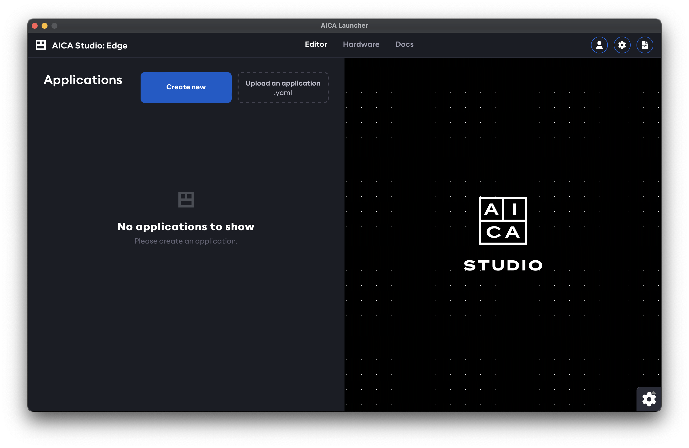

## Pre-requisites

AICA System software is distributed with Docker images and executed with Docker containers.

Before proceeding, [install Docker Engine](https://docs.docker.com/engine/install/) on the host machine.

:::info

For Ubuntu users, make sure to follow
the [post installation steps](https://docs.docker.com/engine/install/linux-postinstall/) to create the `docker` group
and add your user.

:::

:::caution

For Ubuntu users, note that a **Docker Desktop for Linux** installation does **not** include all the necessary 
dependencies. Follow the instructions from the provided link to ensure that all requirements are met.

When installed, Docker Desktop for Linux can **not** be used to manage images and containers created by the AICA System. 
Additionally, you may experience some issues when using AICA System software due to Docker Desktop's custom
configuration (see [manual installation](../reference/02-manual-installation-launch.md) for more details).

:::

## AICA Launcher

AICA Launcher is the easiest way to get up and running with the AICA System. It manages licensing, package distribution
and the Docker toolchain so that no command-line access is necessary. It also embeds AICA Studio: Edge directly inside
the launcher.

### Installation

Find the latest release on the AICA GitHub organization under https://github.com/aica-technology/api/releases, and
search for AICA Launcher (for
example, [AICA Launcher v1.2.0](https://github.com/aica-technology/api/releases/tag/launcher%2Fv1.2.0)).

Download the prebuilt launcher app based on your operating system and architecture. For example,
`aica-launcher-linux-amd64.zip` for Linux machines with an AMD processor or `aica-launcher-darwin-arm64.zip` for macOS
on Apple Silicon.

Unzip the file and extract the AICA Launcher executable to your machine, then launch it by double-clicking or
right-clicking to start the program.

:::tip

On macOS, you may be unable to open the AICA Launcher app because of default security settings.

```
“AICA Launcher” can’t be opened because Apple cannot check it for malicious software.
```

To bypass this, right-click on the app and choose Open, and then click Open on the dialog that appears.

:::

### Entering an AICA System License

When the AICA Launcher is started for the first time (or after explicitly logging out), you will be prompted to enter
your AICA System License. As an example, the online license key to enter might look similar to
`5614D1-3E7A6C-932DEB-8C4189-F6B0F2-V3`.


Once the license is copied into the text field, it will automatically check the validity of the license and log in if
successful. If the license is not recognized, check your internet connection
or [contact AICA support](mailto:support@aica.tech).

### Configuring the AICA System image

AICA Launcher provides direct access to AICA Core and Studio, and additionally simplifies installing add-on packages
from the registry or from custom SDK contributions.

A "configuration" refers to a specific version of AICA Core and the extra packages and versions that should be included.
Defining configurations helps to ensure repeatable builds and deployments, even if AICA Core or any of the referenced
packages are subsequently updated or changed.

The simplest configuration just specifies the AICA Core Version, without any packages. Official packages can be added
from a dropdown, with a version subselection for each package. [Custom packages](../reference/01-intro.md) can be built
using the SDK and then added to the configuration using a Docker image URI.

Advanced configuration options allow setting additional Docker parameters, including real-time permissions and volume
mounting for persistent storage or file-system interactions.


### Launching a configuration

Press the Launch button for any given configuration to start up the AICA System and enter AICA Studio. For the
first time launching a configuration, the AICA Core software image and any additional packages first need to be pulled
from the registry and bundled into the specific runtime image. Depending on network speeds, this may take a while. After
the image has been built, launching the configuration a second time will be much faster as the results are cached.



## Authentication

The AICA System License owner launching an AICA System configuration from AICA Launcher is treated as the system
administrator and has full access to create, manage, control and deploy applications and configurations.

Authentication prevents unauthorized users or software clients from accessing or controlling AICA Studio or the API,
even if they have access to the IP address and port of the AICA Core server.

This section describes how to manage users with specific access scopes to explicitly authorize access to the running
AICA System through a web browser or API client.

:::info

User roles and access scopes for authentication in AICA Studio and the API was introduced in AICA Core v4.3.0.

System administration privileges and API authentication are supported by AICA Launcher as of v1.2.0 and the Python API
Client as of v3.1.0. Upgrade to the latest versions of these tools for full compatibility.

:::

### Users

When using AICA Launcher as the system administrator, AICA Studio is automatically logged in as the privileged
`super-admin` user.

The system administrator (or a user with the `admin` scope) has access to a settings page within AICA Studio to
configure cloud service integration and manage or create other users. Users are created using an email address as the
identifier and can be granted a combination of [scopes](#scopes).

:::note

The email address used to create a new user is only used as an identifier and is unrelated to the email address used for
[licensing](02-licensing.md). Users are defined locally to a specific AICA System Configuration, and access scopes or
passwords are not inferred or shared between different configurations, even if the same email address is used.

:::


A random password is generated for a newly created user and can later be changed by the respective user. If AICA Studio
is accessed from a browser external to AICA Launcher, or if the user of AICA Launcher logs out of the current session, a
valid user email and password must be supplied to log back in to AICA Studio.


The User page in AICA Studio can be used to view the current user with their available scopes, change the password or
create API keys.


:::tip

Refer to our [API client documentation](https://pypi.org/project/aica-api/) for more info on API keys.

:::

### Scopes

AICA Studio may have different or limited functionality depending on the scopes granted to the logged-in user.
Similarly, an API key with appropriate scopes is required to access respective endpoints and functionalities of the API.
The available levels of scopes are described below. 

#### `status`

Read-only access to high-level information about the AICA System such as the available installed features.

#### `monitor`

Read-only access to specific information about the AICA System such as configuration database entries or the
state and live telemetry of running application.

#### `control`

Write-level access to configuration databases and control-level access to set, start and manage running applications.

#### `admin`

Administration access to manage and create users and authorize cloud service integrations.

## Manual installation and launch

For advanced users or users that deal with headless machines, the login, build and launch steps described here can also
be performed [manually from the command line](../reference/02-manual-installation-launch.md) instead of using AICA
Launcher.