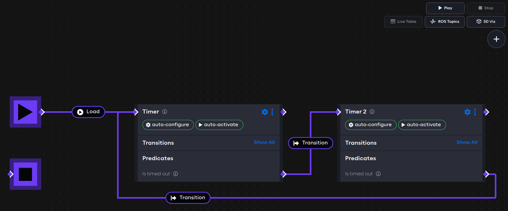
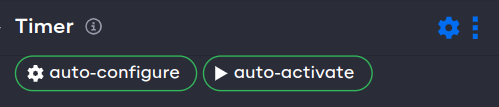
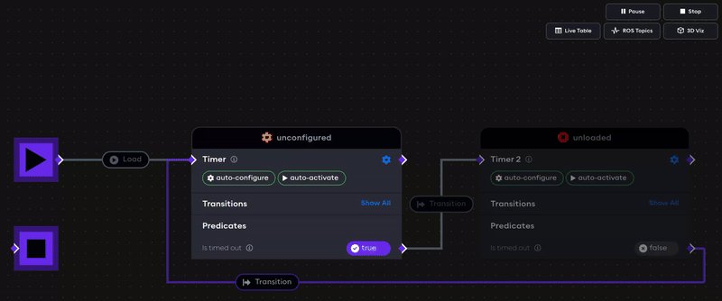

# A basic application example

This example will show how components and predicate events can be used to create dynamic behavior in an AICA
application.

## Launcher configuration requirements

This example uses AICA Core v4.0.0 in the Launcher configuration. Launch the AICA Studio and press Create new.
Copy the following application code into the text box under the Editor tab, replacing the default content.

```yaml
schema: 2-0-2
dependencies:
  core: v4.0.1
on_start:
  load:
    component: timer
components:
  timer:
    component: aica_core_components::utility::Timer
    display_name: Timer
    events:
      transitions:
        on_load:
          lifecycle:
            component: timer
            transition: configure
        on_configure:
          lifecycle:
            component: timer
            transition: activate
      predicates:
        is_timed_out:
          transition: timer_2
    parameters:
      timeout: !!float 2.0
  timer_2:
    component: aica_core_components::utility::Timer
    display_name: Timer 2
    events:
      transitions:
        on_load:
          lifecycle:
            component: timer_2
            transition: configure
        on_configure:
          lifecycle:
            component: timer_2
            transition: activate
      predicates:
        is_timed_out:
          transition: timer
    parameters:
      timeout: !!float 4.0
hardware: {}
graph:
  positions:
    stop:
      x: 0
      y: 160
    buttons:
      button:
        x: 320
        y: 320
      button_2:
        x: 320
        y: -120
    components:
      timer:
        x: 320
        y: -20
      timer_2:
        x: 840
        y: -20
  buttons:
    button:
      display_name: Pause Timer 2
      on_click:
        lifecycle:
          component: timer_2
          transition: deactivate
    button_2:
      display_name: Start Timer 2
      on_click:
        lifecycle:
          component: timer_2
          transition: activate
```

Then, press the Generate Graph button. The graph should show two components connected with event edges.



## The example explained

The application begins with the `on_start` directive to list the initial application events.

```yaml
on_start:
  load:
    component: timer
```

In this case, the first event that occurs in the application is to load the `timer` component.

Application components are listed under the `components` field. Each component has a name and a registration.
The display name field is used just for rendering the component on the graph.

```yaml
  timer:
    component: aica_core_components::utility::Timer
    display_name: Timer
```

In this case, `aica_core_components::utility::Timer` is the registration of a built-in AICA component. It is a lifecycle
component that starts a timer when the component is activated.

Thereafter, the initial component parameters are defined.

```yaml
    parameters:
      rate: !!float 5.0
      timeout: !!float 2.0
```

All components have a `rate` parameter which defines the frequency of periodic execution steps. The default rate for
components is 10 Hertz, so 10 times per second. The component rate can be increased or decreased to make a component run
faster or slower, respectively.

The timer component has a special parameter called `timeout`, which is the duration in seconds that the timer should
be active. At the end of the timeout period, it will be in the "timed out" state.

The `events` field of a component associates component predicates with events.

```yaml
    events:
      transitions:
        on_load:
          lifecycle:
            component: timer
            transition: configure
```

In this case, when the timer component is loaded, it triggers a lifecycle transition to configure itself.
Similarly, the next event activates the timer when it is configured:

```yaml
        on_configure:
          lifecycle:
            component: timer
            transition: activate
```

When a lifecycle component configures or activates itself automatically, this is known as "auto-configure" and
"auto-activate", respectively. The graph shows these events with the green icons next to the component name.



Finally, the timer component has a special predicate `is_timed_out`, which is internally associated with the `timeout`
parameter.

```yaml
      predicates:
        is_timed_out:
          transition: timer_2
```

In this case, after the timer component has been active for 2 seconds, it triggers a transition event to `timer_2`.
The `transition` event from `timer` to `timer_2` is a shorthand for unloading the first component and loading the
second.

The second block describing `timer_2` is nearly identical (apart from a different value for the `timeout` parameter), as
the two timers are intended to have symmetrical behavior.

The `Timer` components are lifecycle components, they have an internal state which is the elapsed time since the first
activation. Deactivating a timer saves the elapsed time and stops it from timing out - it is like pausing a stopwatch.
Activating the timer again is equivalent to unpausing the stopwatch - the elapsed time increases until eventually the
timeout has been reached. To show this behavior, two trigger buttons can be found in the application. The first button
pauses the `timer_2` component by deactivating it while the second one un-pauses the timer by activating it.

```yaml
  buttons:
    button:
      display_name: Pause Timer 2
      on_click:
        lifecycle:
          component: timer_2
          transition: deactivate
    button_2:
      display_name: Start Timer 2
      on_click:
        lifecycle:
          component: timer_2
          transition: activate
```

## Run the application

Press the Play button to start the application.

When the application is started, the `timer` component is loaded. It is initially unconfigured, which triggers it
to be configured. Thereafter, it lands in the inactive lifecycle state, which triggers it to be activated.
Once activated, the timer starts running. After 2 seconds (as specified by the `timeout` parameter), the `is_timed_out`
predicate goes from false to true. As a result, the `transition` event causes `timer` to be unloaded and `timer_2` to be
loaded instead. The second timer then goes through the same steps of configuring and activating before transitioning
back to the first timer.



Use the Pause and Start trigger buttons to deactivate and activate the `timer_2` while it is loaded. Verify that once
paused, the elapsed time does not count towards the component timing out and it only times out once it has been in the
active state for a total of 4 seconds.

Use the Stop button to unload all components and reset the application.

Next, learn how to edit the application using the interactive graph editor.
