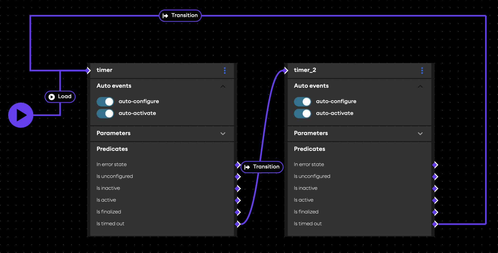

# A basic application example

Open the Developer Interface and copy the following application code into the text box under the Editor tab.

```yaml
components:
  timer:
    component: base_components::utilities::Timer
    position:
      x: 0
      y: -300
    parameters:
      period: 0.1
      timeout: 2.5
    events:
      is_unconfigured:
        lifecycle:
          transition: configure
          component: timer
      is_inactive:
        lifecycle:
          transition: activate
          component: timer
      is_timed_out:
        transition: timer_2

  timer_2:
    component: base_components::utilities::Timer
    position:
      x: 500
      y: -300
    parameters:
      period: 0.1
      timeout: 2.5
    events:
      is_unconfigured:
        lifecycle:
          transition: configure
          component: timer_2
      is_inactive:
        lifecycle:
          transition: activate
          component: timer_2
      is_timed_out:
        transition: timer

on_start:
  load: timer
```

Then, press the Generate Graph button. The graph should show two components connected with event edges.



## The example explained

Application components are listed under the `components` field. Each component has a name and a registration.
The position field is used just for rendering the component on the graph.

```yaml
  timer:
    component: base_components::utilities::Timer
    position:
      x: 0
      y: -300
```

In this case, `base_components::utilities::Timer` is the registration of a built-in AICA component. It is a lifecycle
component that starts a timer when the component is activated.

Thereafter, the initial component parameters are defined.

```yaml
    parameters:
      period: 0.1
      timeout: 2.5
```

All components have a `period` parameter which defines the time interval between periodic execution steps. The default
period for components is 0.1 seconds, so 10 times per second. The component period can be increased or decreased to
make a component run slower or faster, respectively.

The timer component has a special parameter called `timeout`, which is the duration in seconds that the timer should
be active. At the end of the timeout period, it will be in the "timed out" state.

The `events` field of a component associates component predicates with events.

```yaml
    events:
      is_unconfigured:
        lifecycle:
          transition: configure
          component: timer
```

In this case, when the timer component is unconfigured, it triggers a lifecycle transition to configure the timer.
Similarly, the next event activates the timer when it is inactive:

```yaml
      is_inactive:
        lifecycle:
          transition: activate
          component: timer
```

When a lifecycle component configures or activates itself automatically, this is known as "auto-configure" and
"auto-activate", respectively.

Finally, the timer component has a special predicate `is_timed_out`, which is internally associated with the `timeout`
parameter.

```yaml
      is_timed_out:
        transition: timer_2
```

In this case, after the timer component has been active for 2.5 seconds, it triggers a transition event to `timer_2`.
The `transition` event from `timer` to `timer_2` is a shorthand for unloading the first component and loading the
second.

The second block describing `timer_2` is nearly identical, as the two timers are intended to have symmetrical behavior.

The very end of the application uses the `on_start` field to list the initial application events.

```yaml
on_start:
  load: timer
```

In this case, when the application is launched, the `timer` component should be loaded.

## Putting it all together

Press the Play button to start the application.

When the application is started, the `timer` component is loaded. It is initially unconfigured, which triggers it
to be configured. Thereafter, it lands in the inactive lifecycle state, which triggers it to be activated.
Once activated, the timer starts running. After 2.5 seconds (as specified by the `timeout` parameter),
the `is_timed_out` predicate goes from false to true. As a result, the `transition` event causes `timer` to be unloaded
and `timer_2` to be loaded instead. The second timer then goes through the same steps of configuring and activating
before transitioning back to the first timer.

