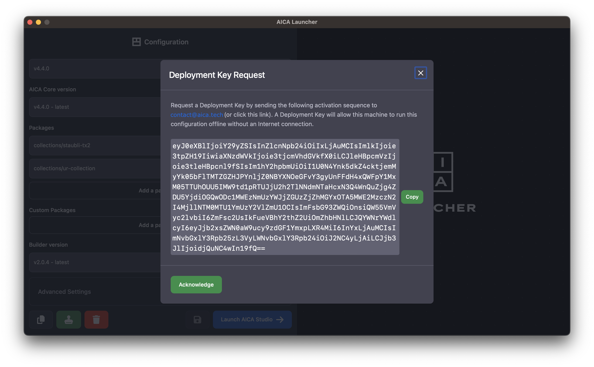

A valid AICA System License is required to access and use AICA System software. Holders of an AICA System License can
also request a Deployment Key for unrestricted offline usage rights of specific deployments.

## AICA System License

A license regulates both the access rights to download AICA software packages and the usage rights to run AICA
applications. To request an AICA System License, contact the AICA sales team at contact@aica.tech. Each new user will
receive access instructions to a personal account for the [AICA license manager](https://licensing.aica.tech/list) which
lists all licenses associated with that user. Every license has a name, an expiration date, the actual license key and a
list of entitlements. On the [AICA package registry](https://registry.licensing.aica.tech/) the user can see all
available packages for one specific license.

:::tip

An AICA System License includes specific entitlements that determine which add-on packages and versions can be accessed
and used. To discover and access additional components and hardware collections, contact your AICA representative to
upgrade your license.

:::

:::caution

Your license key should be kept secret. Do not share your license key with unauthorized users or enter it on websites
other than the official AICA domain. License abuse may prevent your application from running or lead to your license
being revoked.

If an unauthorized user has gained access to your license key, contact support@aica.tech to reset your license.

:::

:::info

- AICA System Licenses are online-only and require an active internet connection while AICA Studio is being used.
- An AICA System License can be used on any machine, but only one instance can be running at any one time.

:::

An AICA System License will appear in the following format, though the specific license key will be unique for each
user.

```console title="Example AICA System License"
5614D1-3E7A6C-932DEB-8C4189-F6B0F2-V3
```

## Deployment Key

A Deployment Key authorizes a specific **deployment** to run offline with no limitations on consecutive or total
activation time. A **deployment** is a single machine (i.e., an industrial edge PC) installed with some configuration
of the AICA System.

A Deployment Key will appear as a very long string of characters in the following format, though the specific key will
be unique for each machine.

```console title="Example AICA Deployment Key"
key/eyJ9df2jfap7IVdIHnlnNpb2482Hh2193L9io8[...]ExMWM3jAuMCJ9.YhsDjwEz8eYnwE21alSBR_tBSIjavblcziV5nBQ==
```

### Requesting a Deployment Key

Deployment Keys can be requested by AICA System License holders by using AICA Launcher v1.3.2 or newer on the target
machine. Press the green stamp icon under a selected configuration to generate a unique machine fingerprint and follow
the instructions to send the activation code to the AICA support team.



They will then generate and send the unique Deployment Key which contains the encrypted machine fingerprint.

---

Continue to the next section to learn how to use the AICA Launcher with the AICA System License to access and install
AICA Studio.
