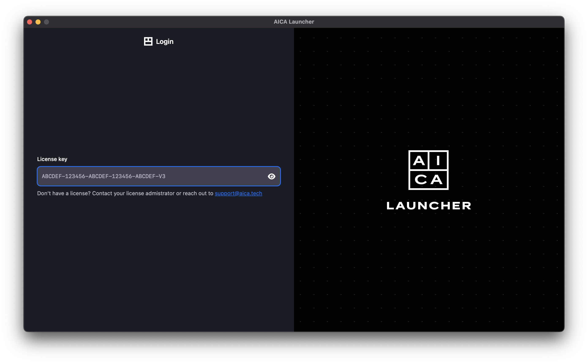
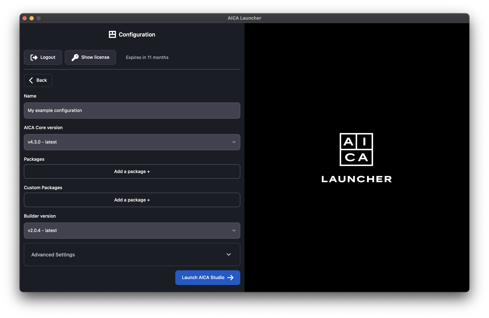
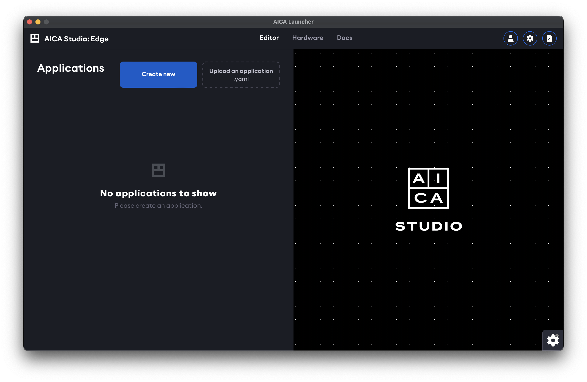

# Installation and launch

## Pre-requisites

AICA System software is distributed with Docker images and executed with Docker containers. That is, it can practically
be installed on any system that supports recent Docker versions. However, due to performance advantages (e.g., real-time
task execution), AICA suggests using Linux-based platforms that can be easily configured for such considerations. 

Before proceeding, you will need to install Docker Engine on the host machine. Depending on your platform, the
installation process may vary or require additional steps. Below, you will find instructions per operating system:

<details>
<summary>Linux</summary>

While AICA currently distributes AICA Launcher for Debian-based systems, other distributions where Docker can be
installed work equally as well through any browser. You may find distribution-specific instructions to install Docker
Engine [here](https://docs.docker.com/engine/install/) and follow the manual installation steps to build and run AICA
Core [here](../../reference/manual-installation-launch.md). Note that you can and it is **recommended** that you skip
the installation of Docker Desktop for Linux.

:::note

For Ubuntu users, make sure to follow
the [post installation steps](https://docs.docker.com/engine/install/linux-postinstall/#manage-docker-as-a-non-root-user)
to create the `docker` group and add your user.

:::

:::caution

For Ubuntu users that need a **Docker Desktop for Linux**, note that its installation does **not** include all the
necessary dependencies. Follow the instructions from the provided link to ensure that all requirements are met.

When installed, Docker Desktop for Linux can **not** be used to manage images and containers created by the AICA System. 
Additionally, you may experience some issues when using AICA System software due to Docker Desktop's custom
configuration (see [manual installation](../../reference/manual-installation-launch.md) for more details).

:::

</details>

<details>
<summary>MacOS</summary>

The simplest way to install Docker Engine on MacOS is through 
[Docker Desktop](https://docs.docker.com/desktop/setup/install/mac-install/). However, some limitations may apply
regarding commercial use (see relevant article 
[here](https://www.docker.com/blog/revisiting-docker-hub-policies-prioritizing-developer-experience/)). If you intend to
operate Docker Desktop within the terms of service, make sure that 
[these](../../reference/manual-installation-launch.md#configuring-docker-on-your-linux-or-macos-system) additional configuration steps are
taken.

:::note

The majority of AICA Studio and Launcher features are available in MacOS. However:

- Forwarding graphics is currently impossible due to MacOS' incompatibility with OpenGL 2.1+. As a result, tools like
RViz will not be made available through AICA Launcher.
- Realtime applications may be subject to performance limitations due to MacOS' resource management.

:::

</details>

<details>
<summary>Windows</summary>

**No official support is currently provided for Windows machines.** However, with the correct Windows Subsystem for
Linux (WSL) configuration you can install the AICA framework manually. 
<!-- TODO: update/provide link (see [manual installation instructions](../../reference/manual-installation-launch.md) for reference). -->

</details>

## AICA Launcher

AICA Launcher is the easiest way to get up and running with the AICA System. It manages licensing, package distribution
and the Docker toolchain so that no command-line access is necessary. It also embeds AICA Studio: Edge directly inside
the launcher.

### Installation

Find the latest release on the AICA GitHub organization under https://github.com/aica-technology/api/releases, and
search for AICA Launcher (for
example, [AICA Launcher v1.2.0](https://github.com/aica-technology/api/releases/tag/launcher%2Fv1.2.0)).

Download the prebuilt launcher app based on your operating system and architecture. For example,
`aica-launcher-linux-amd64.zip` for Linux machines with an AMD processor or `aica-launcher-darwin-arm64.zip` for macOS
on Apple Silicon.

Unzip the file and extract the AICA Launcher executable to your machine, then launch it by double-clicking or
right-clicking to start the program.

:::tip

On macOS, you may be unable to open the AICA Launcher app because of default security settings.

```
“AICA Launcher” can’t be opened because Apple cannot check it for malicious software.
```

To bypass this, right-click on the app and choose Open, and then click Open on the dialog that appears.

:::

### Entering an AICA System License

When the AICA Launcher is started for the first time (or after explicitly logging out), you will be prompted to enter
your AICA System License. As an example, the online license key to enter might look similar to
`5614D1-3E7A6C-932DEB-8C4189-F6B0F2-V3`.



Once the license is copied into the text field, it will automatically check the validity of the license and log in if
successful. If the license is not recognized, check your internet connection
or contact AICA support.

### Configuring the AICA System image

AICA Launcher provides direct access to AICA Core and Studio, and additionally simplifies installing add-on packages
from the registry or from custom SDK contributions.

A "configuration" refers to a specific version of AICA Core and the extra packages and versions that should be included.
Defining configurations helps to ensure repeatable builds and deployments, even if AICA Core or any of the referenced
packages are subsequently updated or changed.

The simplest configuration just specifies the AICA Core Version, without any packages. Official packages can be added
from a dropdown, with a version subselection for each package. [Custom packages](../../reference/intro.md) can be built
using the SDK and then added to the configuration using a Docker image URI.

Advanced configuration options allow setting additional Docker parameters, including real-time permissions and volume
mounting for persistent storage or file-system interactions.



### Launching a configuration

Press the Launch button for any given configuration to start up the AICA System and enter AICA Studio. For the
first time launching a configuration, the AICA Core software image and any additional packages first need to be pulled
from the registry and bundled into the specific runtime image. Depending on network speeds, this may take a while. After
the image has been built, launching the configuration a second time will be much faster as the results are cached.



## Manual installation and launch

For advanced users or users that deal with headless machines, the login, build and launch steps described here can also
be performed [manually from the command line](../../reference/manual-installation-launch.md) instead of using AICA
Launcher.