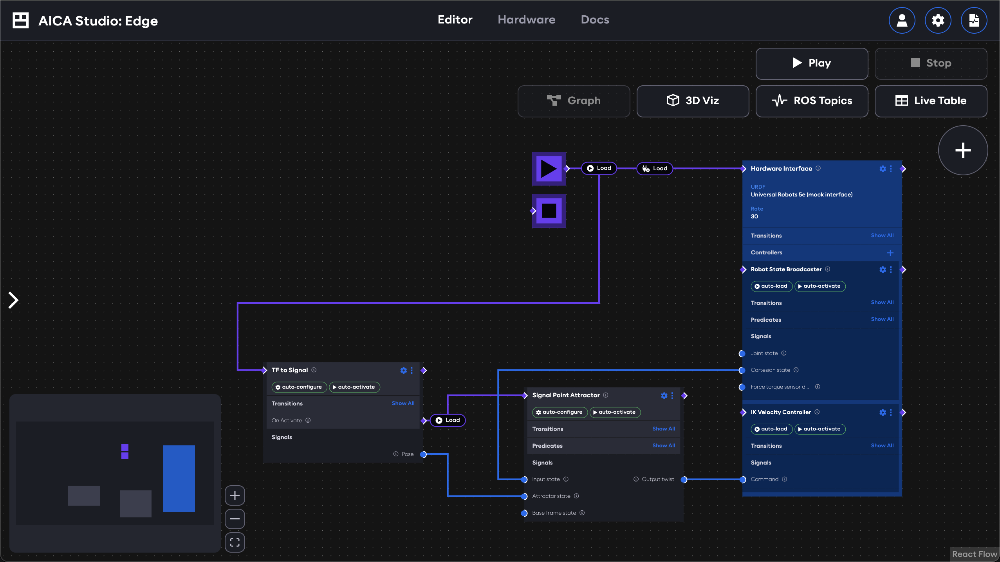
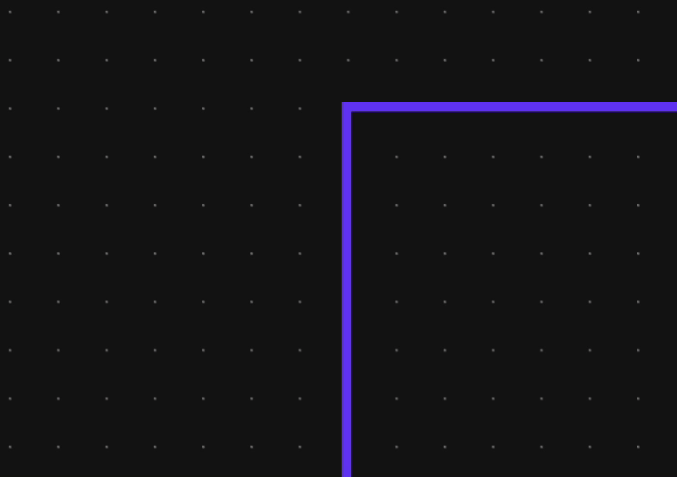
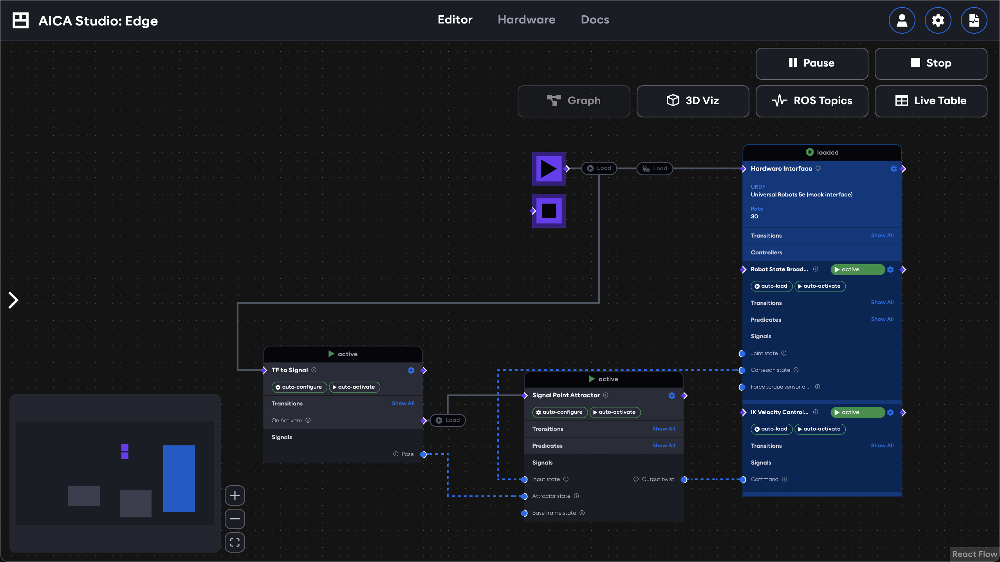

import Tabs from '@theme/Tabs';
import TabItem from '@theme/TabItem';
import EventHandle from './assets/event-handle.svg';
import SignalHandle from './assets/signal-handle.svg';

The AICA application graph is a unique way of expressing complex and reactive logic for robotic control. It combines
data-flow programming of continuous signals with event-driven logic and state management.

In this section, the basic elements and interactions of the application graph will be described at a high level.
Mastering the graph is key to unlocking advanced programming capabilities, so be sure to continue reading further
concepts and examples later in this documentation.

## Nodes and edges

In graph terminology, a node is a block in the graph and an edge is a connecting line. The nodes in the AICA application
graph represent **components** (generic computational blocks that process input data and produce output data) and
**hardware interfaces** (drivers to externally connected devices that follow control commands from components),
alongside built-in elements such as sequence or condition blocks or the start/stop nodes.

The edges connecting these nodes represent either **signals** (blue) or **events** (purple). Signals are used for
continuous data exchange (e.g., control loops, signal processing, or other kinds of data flow) while event edges capture
discrete logic (e.g., triggering events or representing conditional true/false states).

:::info

These application building blocks are described in more detail in
the [concepts](/docs/category/application-building-blocks) section.

:::

## Interacting with the graph

Click and drag on the background of the graph or on the mini-map on the bottom left to pan the view and zoom in and out
by scrolling. The graph control buttons next to the mini-map can also be used to zoom and fit the view.

### Adding and deleting nodes

Nodes can be added to the graph using the sidebar menu; press the (+) button in the top right corner of the graph to
open the sidebar and see a list of available application elements. At the top of the list are the "Hardware Interface",
"Trigger Events Button", "Sequence" and "Condition" nodes. These are followed by a list of all available components from
AICA Core and any additionally installed packages, grouped by package. Clicking on any element in the sidebar will
automatically add it to the graph.

Nodes can be moved by clicking and dragging them. Depending on the type of node, clicking on various parts of the node
will provide additional interaction options such as changing the display name, configuring parameters or expanding /
collapsing certain fields.

To delete a node from the graph, press the small menu icon in its top right corner, then click Remove.

:::tip

<Tabs groupId="os">
<TabItem value="linux" label="Linux">

Nodes can also be deleted by selecting them with a click and pressing the Backspace key on your keyboard.

</TabItem>
<TabItem value="mac" label="macOS">

Nodes can also be deleted by selecting them with a click and pressing the Delete key on your keyboard.

</TabItem>
</Tabs>

:::

### Managing graph edges

Edge connections can be made between nodes using the respective signal edge
handle <SignalHandle className="inlineEdgeHandleSVG"/> and event edge
handle <EventHandle className="inlineEdgeHandleSVG"/>. The white side of the handle indicates the directionality of the
edge; when the white side is facing away from a node, the handle is an "output" or a "source" for the edge. When the
white side is facing towards the node, the handle is an "input" or a "target". Edges can only be connected between
compatible handles, which generally means inputs can only be connected to outputs, and signal and event edges cannot
be mixed.

Click and drag from one handle to another compatible handle to make a new edge connection. Alternatively, click once on
one handle and click again on another handle to make the edge connection and avoid dragging across the graph.

#### Changing an event type

Event edges show the type of event they trigger as a label on the edge. To change the type of event that should be
triggered, click on the event label on the edge to open a selection menu showing other available event types (for
example, Load, Unload, Configure...) and click on the desired event.

#### Customizing edge paths

Edge paths can be manually edited for better graph layouts in any of the following ways:

- Drag an edge segment
- Click once on an edge to create a breakpoint, then drag the edge segment on either side of the breakpoint
- Click on two parts of the edge to create two breakpoints, then drag the intermediate edge segment

Note that dragging the first and last edge segments (i.e., those that connect directly to the edge handle) is not
possible without first creating a breakpoint.

:::tip

<Tabs groupId="os">
<TabItem value="linux" label="Linux">

To delete an edge, select it with a click and then press the Backspace key on your keyboard.

</TabItem>
<TabItem value="mac" label="macOS">

To delete an edge, select it with a click and then press the Delete key on your keyboard.

</TabItem>
</Tabs>

:::

## Runtime states

When an application is running, the graph view shows the states of each component in a banner above the node. It also
indicates which signals are actively transporting data with line animations and which event edges are triggered with
highlighting colors.

Next, take a look at some of the other available application views.