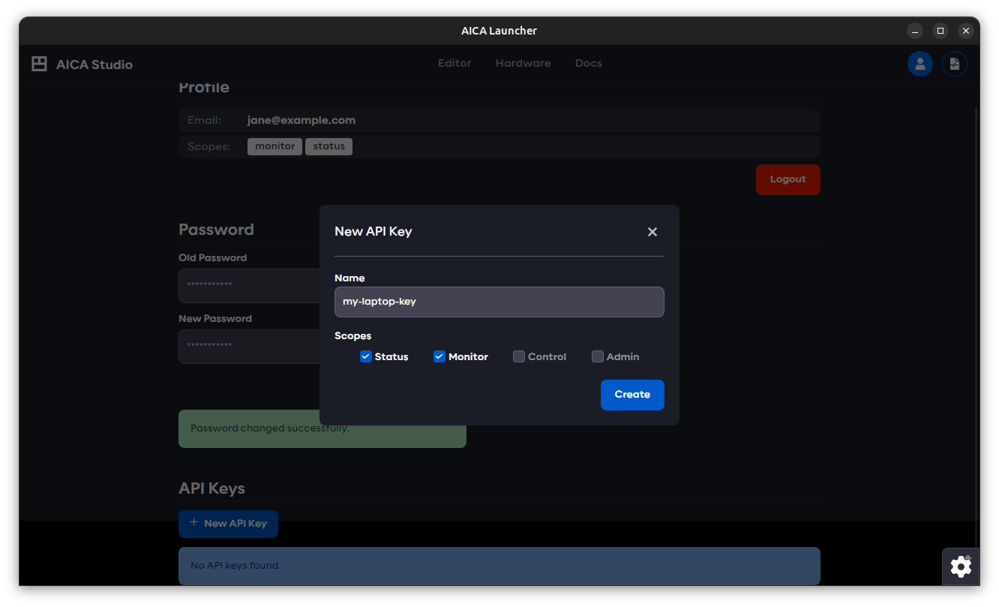

import newPassword from './assets/aica-studio-new-password.png'

# Users and authentication

Authentication prevents unauthorized users or software clients from accessing or controlling AICA Studio or the API,
even if they have access to the IP address and port of the AICA Core server.

The AICA System License owner launching an AICA System configuration from AICA Launcher is treated as the system
administrator and has full access to create, manage, control and deploy applications and configurations.

This section describes how to manage users with specific access scopes to explicitly authorize access to the running
AICA System through a web browser or API client.

:::info

User roles and access scopes for authentication in AICA Studio and the API were introduced in AICA Core v4.3.0.

System administration privileges and API authentication are supported by AICA Launcher as of v1.2.0 and the Python API
Client as of v3.1.0. Upgrade to the latest versions of these tools for full compatibility.

:::

## Users

When using AICA Launcher as the system administrator, AICA Studio is automatically logged in as the privileged
`super-admin` user.

The system administrator (or a user with the `admin` scope) has access to a settings page within AICA Studio to
configure cloud service integration and manage or create other users. Users are created using an email address as the
identifier and can be granted a combination of [scopes](#scopes).

:::note

The email address used to create a new user is only used as an identifier and is unrelated to the email address used for
[licensing](installation/licensing.md). Users are defined locally to a specific AICA System Configuration, and access
scopes or passwords are not inferred or shared between different configurations, even if the same email address is used.

:::

If AICA Studio is accessed from a browser external to AICA Launcher, or if the user of AICA Launcher logs out of the
current session, a valid user email and password must be supplied to log back in to AICA Studio. To create a new user
account, click on the **New User** button in the **Settings** tab, provide an email address and the desired scopes.

A random password is generated for the newly created user. It is only shown once, so it should be copied and stored for
later use. If the password needs to be changed, first log out from the **User** screen (or open AICA Studio in a new
browser session), and log in as the new user with the generated password. Then, change the password in the User screen
by entering the generated (old) and the desired (new) password.

  

The User page in AICA Studio can be used to view the current user with their available scopes, change the password or
create API keys.

## API Keys

Other than accessing Studio through a browser, users can interact with the AICA Core using the AICA API client. For AICA
Core v4.3.0 and later, an API key is required for authentication. This can be generated in the User page in AICA Studio,
by clicking on the **New API Key** button. Provide a name and the desired scopes - note that these can not surpass the
scope of the logged in user.

:::warning

For security reasons, the privileged `super-admin` user cannot be used to create or manage API keys. Create a new user
with the necessary scopes before creating an API key as that user.

:::

As was the case with the new user password, the newly created key has to be copied and saved right away, as it cannot be
accessed later. It can then be shared with interested parties, that can use it to authenticate and access AICA Core.

:::tip

Refer to our [API client documentation](https://pypi.org/project/aica-api/) for more info on API keys.

:::

## Scopes

AICA Studio may have different or limited functionality depending on the scopes granted to the logged-in user.
Similarly, an API key with appropriate scopes is required to access respective endpoints and functionalities of the API.
The available levels of scopes are described below.

### `status`

Read-only access to high-level information about the AICA System such as the available installed features.

### `monitor`

Read-only access to specific information about the AICA System such as configuration database entries or the state and
live telemetry of running application.

### `control`

Write-level access to configuration databases and control-level access to set, start and manage running applications.

### `admin`

Administration access to manage and create users and authorize cloud service integrations.
